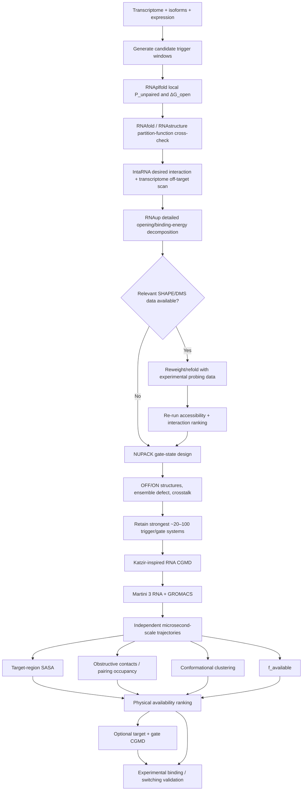

# RNA Target-Region Accessibility for Intermolecular Binding

> **Scope of this revision:** the dynamic molecular-simulation component is based on the **coarse-grained strategy used by Katzir et al. (2026)**. Conventional all-atom MD is not part of the recommended CERNAL accessibility pipeline in this version.

## Executive summary

For an RNA trigger or gate, **“is this subsequence present?” is not the same question as “is this subsequence available to bind another RNA?”** A useful accessibility workflow therefore needs to distinguish three increasingly physical quantities:

\[
\text{secondary-structure accessibility}
\;\rightarrow\;
\text{effective RNA–RNA binding accessibility}
\;\rightarrow\;
\text{3D/dynamic exposure}
\]

The most useful first-line quantity is the probability that the intended target interval is simultaneously unpaired,

\[
P_{\mathrm{unpaired}}(i,j),
\]

or its equivalent opening penalty,

\[
\Delta G_{\mathrm{open}}(i,j)=-RT\ln P_{\mathrm{unpaired}}(i,j).
\]

This is exactly the type of quantity calculated by **RNAplfold** and **Raccess**, and it is more appropriate for trigger screening than relying on an RNAfold minimum-free-energy structure. RNAplfold is especially attractive for transcriptome-scale work because its local dynamic-programming formulation scales as \(O(nL^2)\) for sequence length \(n\) and local window/span parameter \(L\), and directly reports probabilities that consecutive nucleotide stretches are unpaired. citeturn16view0turn17view6

For the next stage, **IntaRNA and RNAup are more informative than accessibility alone**, because they combine the cost of exposing a target with the energetic benefit of forming the intermolecular duplex. RNAup explicitly decomposes binding into opening and interaction components using partition functions, while IntaRNA adds accessibility and a user-definable seed and is practical enough for large target searches. A substantial benchmark found accessibility-aware methods among the strongest classical RNA–RNA interaction predictors, although performance varies by interaction class; a newer 2025 benchmark reinforces that RNA–RNA interaction prediction remains an unsolved problem rather than a source of ground truth. citeturn16view1turn16view3turn15search0turn15search4

For a **synthetic gate**, NUPACK is particularly useful because the design problem is no longer merely “find an accessible native target.” One must simultaneously stabilize the OFF state, enable the desired ON complex, and suppress competing structures and crosstalk. NUPACK's partition-function/test-tube framework explicitly represents on-target and off-target complexes, equilibrium concentrations, and **ensemble defect**, making it a strong choice for gate-state optimization after endogenous targets have been shortlisted. citeturn17view1turn18view4

When **SHAPE or DMS data from the relevant biological context** are available, they should be treated as high-value evidence rather than an optional embellishment. RNAstructure, ViennaRNA-compatible workflows, RNA Framework, and IntaRNA can incorporate probing-derived information; experimental SHAPE-derived accessibility data have been shown to significantly improve RNA–RNA interaction prediction in an IntaRNA-based study. Public sources such as **RASP v2.0** and **RMDB** can sometimes supply existing probing data. citeturn16view5turn19view5turn15search1turn19view7turn19view8

**The physical simulation layer should use coarse-grained molecular dynamics (CGMD), following the strategy used by Katzir et al. (2026), rather than conventional all-atom MD.** Katzir and colleagues modeled programmable ssDNA by building structural models, converting them to a Martini coarse-grained representation, and running microsecond-scale CGMD in GROMACS. They analyzed conformational ensembles using quantities including solvent-accessible surface area (SASA), radius of gyration and intermolecular contacts. Their system was ssDNA, not RNA, so the CERNAL adaptation should use an RNA-specific coarse-grained model, with **Martini 3 RNA + GROMACS** as the closest modern analogue. [Katzir et al., ACS Nano 2026](https://doi.org/10.1021/acsnano.6c03646); [Martini 3 RNA model](https://doi.org/10.1016/j.bpj.2025.07.034).

For a trigger/gate compiler, the recommended stack is therefore:

**RNAplfold → IntaRNA → RNAup/NUPACK → SHAPE/DMS refinement when available → Katzir-inspired Martini 3 RNA CGMD + GROMACS → experimental validation.**

The CGMD layer does not replace thermodynamic accessibility. It asks a complementary physical question: **across the three-dimensional conformational ensemble sampled by the RNA, how often is the exact recognition region physically exposed and interaction-compatible?**

The central design principle is to **never reduce “RNA availability” to total RNA SASA**. A target nucleotide can be solvent exposed yet still be paired, geometrically inaccessible to productive duplex initiation, or occupied by a protein. For an intermolecular RNA gate, the most informative late-stage MD descriptor would combine **target-region SASA + native base-pair occupancy + fraction of time an initiation seed is simultaneously exposed**, rather than SASA alone.

## What accessibility should mean

There are several related but non-equivalent definitions of RNA accessibility, and confusing them can produce a poor trigger-ranking model.

### Secondary-structure accessibility

For a target interval \(s=[i,j]\), define

\[
P_{\mathrm{unpaired}}(i,j)
=
P(\text{all nucleotides }i\dots j\text{ are unpaired}).
\]

This differs substantially from averaging individual nucleotide unpaired probabilities:

\[
P_{\mathrm{unpaired}}(i,j)
\neq
\frac{1}{j-i+1}
\sum_{k=i}^{j}P_{\mathrm{unpaired}}(k).
\]

A 20-nt binding site requires a sufficiently long **simultaneously available nucleation region**, not merely twenty nucleotides that are individually unpaired at different times. RNAplfold directly calculates probabilities for consecutive unpaired stretches; Raccess defines accessibility as the Boltzmann probability that no base in the selected segment is paired. citeturn16view0turn18view0

The corresponding opening penalty is naturally expressed as

\[
\boxed{
\Delta G_{\mathrm{open}}(i,j)
=
-RT\ln P_{\mathrm{unpaired}}(i,j)
}
\]

where lower values are better. Raccess explicitly uses this relationship, describing \(\Delta E_{\rm acc}\) as the thermodynamic work associated with opening the target interval. citeturn17view6

This is probably the **best computational definition of “RNA availability” for a first-pass trigger-selection algorithm**.

### Interaction-aware accessibility

An exposed region is useful only if the intended gate can form a sufficiently favorable interaction with it.

A simplified decomposition is:

\[
\Delta G_{\mathrm{effective}}
\approx
\Delta G_{\mathrm{open,target}}
+
\Delta G_{\mathrm{open,gate}}
+
\Delta G_{\mathrm{hybridization}}.
\]

RNAup implements essentially this concept: it first calculates the energetic cost/probability of opening a potential site and then combines accessibility with intermolecular interaction energy; it can report the interaction component and opening component separately. citeturn16view1

IntaRNA follows the same broad physical idea while also explicitly supporting seed constraints and efficient target search. Its developers describe accessibility of the interaction sites and the existence of a seed as central features. citeturn16view3

This distinction matters for a compiler. A region with excellent \(P_{\rm unpaired}\) but mediocre complementarity may be inferior to a somewhat less exposed region whose binding free energy comfortably compensates for its opening penalty.

### Three-dimensional and cellular accessibility

A separate property is **solvent-accessible surface area, SASA**:

\[
SASA_{\mathrm{target}}(t).
\]

RNAsnap2 predicts per-nucleotide RNA solvent accessibility from sequence-derived information; GROMACS `gmx sasa` calculates SASA directly from a static structure or trajectory and allows an output subset—such as the exact trigger interval—to be extracted from the total molecular surface. citeturn17view3turn16view7

However,

\[
\boxed{
\text{high SASA}\not\Rightarrow\text{hybridization-ready}
}
\]

because SASA measures exposure to a solvent-sized probe, not the free-energy barrier or geometry required for another RNA strand to nucleate and propagate a duplex. Likewise, secondary-structure predictions omit many aspects of the intracellular environment. In-cell RNA can be affected by RNA-binding proteins, ribosomes, ligands, ions and alternative conformations. Structure-probing approaches help bridge that gap experimentally, although probing reactivity itself remains an indirect structural measurement rather than a direct measurement of gate-binding probability. RNA Framework supports transcriptome-scale SHAPE, DMS and related probing workflows, while RASP aggregates both footprinting and RNA–RNA interaction datasets. citeturn19view5turn19view8

For an RNA-trigger compiler, I would therefore use:

\[
\boxed{
\text{thermodynamic accessibility}
+
\text{interaction energetics}
+
\text{experimental context}
+
\text{dynamic 3D exposure}
}
\]

in that order of computational expense.

## Curated tool comparison

| Tool / primary source | Method type | Typical input → output | Strengths and limitations for target accessibility | Scale / runtime | License / availability |
|---|---|---|---|---|---|
| **[RNAfold / ViennaRNA](https://www.tbi.univie.ac.at/RNA/)** · [ViennaRNA documentation](https://viennarna.readthedocs.io/) | Thermodynamic secondary structure; partition function | RNA sequence → MFE structure, ensemble free energy, base-pair probabilities, centroid/ensemble descriptors | Excellent baseline and mature thermodynamic engine. **Do not use MFE structure alone as an accessibility score**; use partition-function probabilities instead. ViennaRNA's partition-function mode reports pairing probabilities and ensemble properties. citeturn1search14turn1search7 | Single transcripts to batched datasets; ordinary global partition calculations become expensive for very long RNAs | ViennaRNA source/software available; license permits broad use but has specific redistribution/commercial-product terms—review them for product deployment. citeturn1search8 |
| **[RNAplfold](https://www.tbi.univie.ac.at/RNA/ViennaRNA/doc/html/man/RNAplfold.html)** | Local partition function / unpaired probability | Long RNA + window/span + maximum unpaired length → local pair probabilities, \(P_{\rm unpaired}\), opening-energy-like output | **Best default transcriptome accessibility engine.** Directly calculates probability that consecutive stretches are unpaired. Window/span approximation means distant structural interactions may be omitted. citeturn16view0 | \(O(nL^2)\) time, \(O(n+L^2)\) memory; specifically designed to scan very large sequences. citeturn16view0 | Part of ViennaRNA |
| **[RNAup](https://www.tbi.univie.ac.at/RNA/ViennaRNA/doc/html/man/RNAup.html)** · [method paper](https://pubmed.ncbi.nlm.nih.gov/16446276/) | RNA–RNA interaction + partition-function accessibility | One or two RNAs → opening energies, interaction energy, total binding free energy and predicted interaction region | Particularly valuable because it separates \(\Delta G_{\rm open}\) from intermolecular interaction energy. More expensive than RNAplfold and less convenient as the very first transcriptome-wide screen. citeturn16view1 | Best for shortlisted sites/pairs rather than exhaustive all-vs-all transcriptomes | Part of ViennaRNA |
| **[NUPACK 4](https://docs.nupack.org/)** · [current NUPACK paper](https://pubmed.ncbi.nlm.nih.gov/41926704/) | Partition-function/test-tube thermodynamics; multistrand design | Multiple RNA strands, concentrations, target states → partition functions, pair probabilities, complex concentrations, ensemble defect, designed sequences | **Excellent for gate design and crosstalk**, especially OFF/ON/multistate design. Its thermodynamic ensemble is still a secondary-structure model rather than a cellular 3D simulation. It explicitly models undesired complexes in test-tube design. citeturn17view1turn18view4 | Best from dozens to hundreds/thousands of candidate gate designs rather than complete mammalian transcriptome pairwise enumeration | Licensed access; academic/noncommercial and commercial terms are controlled by NUPACK's current licensing/subscription system. citeturn19view1turn19view2 |
| **[IntaRNA](https://backofenlab.github.io/IntaRNA/)** · [IntaRNA 2.0 paper](https://doi.org/10.1093/nar/gkx279) | RNA–RNA interaction with accessibility + seed model | Query RNA + target RNA(s), optional seed/accessibility constraints → interacting positions, structure, interaction energy/ranking | Strong practical tool for **on-target binding and transcriptome crosstalk screening**. Explicitly includes accessibility and user-defined seeds. Classical interaction prediction is approximate and accuracy depends strongly on biological interaction class. citeturn16view3turn15search0turn15search4 | Suitable for large target collections/genome-scale searches; much more scalable than MD | Open-source; MIT license in current repository. citeturn7search6 |
| **[Raccess](https://academic.oup.com/bioinformatics/article/27/13/1788/184734)** | Partition-function / exact local accessibility under maximum pair span | RNA + target-window length + maximum base-pair span → \(P_{\rm acc}\), \(\Delta G_{\rm open}\) for intervals | Very clean mathematical definition of subsequence accessibility; avoids some sliding-window boundary effects. Older implementation/ecosystem and less actively maintained than ViennaRNA. citeturn18view0turn18view1 | \(O(NW^2)\); designed for long sequences; historically several-fold slower than RNAplfold in many cases. citeturn18view1 | Research software; original distribution is comparatively legacy and should be containerized/reproducibility-tested before compiler integration |
| **[Sfold](https://sfold.wadsworth.org/)** · [method/server literature](https://pubmed.ncbi.nlm.nih.gov/?term=Sfold+RNA+Ding+Lawrence)** | Boltzmann ensemble sampling / probability profiling | Sequence → sampled structural ensemble, accessibility/probability profiles, target-design analyses | Useful because it represents an **ensemble rather than a single MFE structure**. Sampling permits flexible statistics but introduces sampling noise, especially for rare accessible states and large structure spaces. citeturn18view0turn18view1 | \(O(NW^2+MNW)\) in the Raccess comparison, where \(M\) is number of sampled structures. citeturn18view1 | Web/software availability remains; verify current distribution/license terms before automated commercial deployment |
| **[CONTRAfold](https://contra.stanford.edu/contrafold/)** · [original paper](https://pubmed.ncbi.nlm.nih.gov/?term=CONTRAfold+Do+Woods+Batzoglou)** | Probabilistic/discriminative secondary-structure model | Sequence → predicted structure and posterior pairing probabilities | Useful **orthogonal model** because it learns a conditional log-linear scoring model rather than relying solely on thermodynamic parameters. Not a direct physical calculation of opening work or RNA–RNA binding. citeturn2search7turn11search9 | Single/batched sequences; computationally much cheaper than MD | BSD-style open-source distribution. citeturn11search1 |
| **[RNAstructure](https://rna.urmc.rochester.edu/RNAstructure.html)** / Partition / OligoWalk | Thermodynamic structure, partition function, oligo binding; SHAPE-informed | Sequence ± experimental constraints ± oligo → MFE/ensemble probabilities, bimolecular structures, oligo binding affinity | Strong alternative/cross-check to ViennaRNA. Especially valuable because one package combines base-pair probabilities, oligo-target affinity and multiple experimental mapping constraints, including SHAPE. citeturn16view5 | Single transcripts and moderate batches; OligoWalk-style exhaustive accessibility is more expensive than RNAplfold; historical comparison reports \(O(N^3)\). citeturn18view1 | Free, GNU GPL; command line, GUI and source. citeturn16view5 |
| **[RNA Framework](https://rnaframework-docs.readthedocs.io/)** / SHAPE–DMS workflows | SHAPE/DMS-informed, experimental-processing framework | Probing sequencing reads → mapped/normalized reactivities → experimentally restrained structures | Strong choice when generating or processing actual probing data. Handles reference creation, read preprocessing, mapping, normalization and structure prediction incorporating probing measurements. Not itself a substitute for RNA–RNA interaction scoring. citeturn19view5 | Explicitly designed for high-throughput/transcriptome-scale probing datasets | GPL v3+. citeturn19view5 |
| **ViennaRNA `RNAprobing` / soft-constraint ecosystem** | SHAPE/DMS-informed thermodynamic prediction | Sequence + probing reactivity → pseudo-energy/perturbation constraints → reweighted structural ensemble | Convenient when the compiler already uses ViennaRNA. Experimental restraints can move predictions toward measured accessibility, but outcome depends on probing quality and the reactivity-to-energy transformation. citeturn12search15turn15search1 | Transcript-by-transcript; scalable after preprocessing | ViennaRNA licensing |
| **[RNAsnap2](https://github.com/jaswindersingh2/RNAsnap2)** · [paper](https://doi.org/10.1093/bioinformatics/btaa652) | ML-predicted 3D solvent accessibility | RNA sequence ± sequence-profile features → per-nucleotide predicted ASA | Useful orthogonal **3D exposure proxy**. Its network incorporates predicted pair-probability information from LinearPartition. **Not equivalent to \(P_{\rm unpaired}\) or binding accessibility.** citeturn17view3turn18view2 | Current documented memory guidance is roughly <500 nt for profile mode and <2,000 nt for single-sequence mode on ~32 GB RAM, so not a convenient whole-transcriptome first stage. citeturn18view2 | MPL 2.0. citeturn17view4 |
| **[RASP v2.0](https://rasp2.zhanglab.net/)** | Experimental probing database | Transcript/species/method query → experimental structure scores, footprinting/proximity-ligation datasets | Excellent source for checking whether relevant in-cell/in-vitro structural data already exist. Current v2.0 reports 438 datasets, including 216 transcriptome-wide, 141 target-specific and 81 RNA–RNA interaction datasets. citeturn19view8 | Database lookup; no MD cost | Public web database |
| **[RMDB](https://rmdb.stanford.edu/)** | Experimental probing database | RNA/experiment query → curated SHAPE, DMS, CMCT, mutate-and-map and related data | High-value repository for experimental validation/training. Data are heterogeneous across conditions, so cell type, temperature, ligands and protocol must match the intended context. citeturn19view7 | Database | Public archive; RDAT format |
| **RiboSNitchDB / Riprap** · [Ouyang Lab](https://people.umass.edu/ouyanglab/software.html) | Variant-induced RNA structural-change resource | WT + variant sequence / variant query → predicted or validated structural disruption | **Not a direct accessibility predictor.** Valuable late in trigger selection to reject regions whose accessibility may be genotype-sensitive because of common SNVs. citeturn19view9 | Variant-level screening | Public research resources |
| **[oxDNA/oxRNA](https://dna.physics.ox.ac.uk/index.php?title=Main_Page)** | Nucleotide-level coarse-grained MD/Monte Carlo | RNA sequence/configuration → trajectories, folding/hybridization states, contacts and thermodynamics | Excellent CG choice for nucleic-acid-only switching, duplex formation, hairpin opening and strand-displacement-like mechanisms. It models RNA at nucleotide-level coarse resolution and reaches processes beyond typical atomistic timescales. citeturn16view8 | Finalists; CPU/GPU. Orders of magnitude costlier than secondary-structure DP, but dramatically cheaper than equivalent all-atom sampling | GPL-3.0; CPU/NVIDIA GPU implementation. citeturn19view10 |
| **[Martini 3 RNA](https://cgmartini.nl/)** · [RNA model paper](https://pubmed.ncbi.nlm.nih.gov/40753455/) + **[GROMACS](https://www.gromacs.org/)** | **Katzir-inspired coarse-grained MD** | RNA structural model → Martini CG representation → microsecond-scale trajectory → local SASA, \(R_g\), contacts, conformational clusters and target-region exposure | **Preferred physical-simulation layer for this design.** It adapts the strategy used by Katzir et al. for ssDNA to RNA. The dedicated Martini 3 RNA model supports ssRNA, dsRNA and RNA–protein systems. Because the RNA model is comparatively new, results should be calibrated against thermodynamic predictions and experiments rather than treated as ground truth. | Tens of shortlisted candidates are realistic with automation and parallel GPU/HPC execution; much heavier than RNAplfold/IntaRNA, but far more tractable than conventional all-atom MD | Use a single standardized Martini/GROMACS protocol when comparing accessibility scores |

**A note on AWSEM:** [OpenAWSEM/AWSEM](https://github.com/npschafer/openawsem) is fundamentally a **coarse-grained protein force field**, not a standalone RNA accessibility model. It should therefore not appear in the primary RNA-accessibility stack unless a bespoke protein–RNA multiscale model explicitly couples it to a nucleic-acid representation. For RNA itself, oxRNA or an RNA-compatible Martini model is the more direct choice. citeturn5search2turn5search20

## Models and algorithms

### ViennaRNA, RNAfold and RNAplfold

ViennaRNA's classical thermodynamic framework treats secondary structures with nearest-neighbor free-energy parameters and dynamic programming. RNAfold's MFE output asks for one minimum-energy secondary structure, whereas its partition-function calculation considers the Boltzmann ensemble and produces base-pair probabilities. The latter is conceptually much closer to accessibility. citeturn1search14turn1search7

For trigger selection, **RNAplfold is usually more directly useful than RNAfold**. RNAplfold computes local base-pair probabilities over a bounded interaction span; with `-u`, it reports the probability that stretches of one through \(u\) consecutive nucleotides remain unpaired. Its official implementation has:

\[
T=O(nL^2), \qquad M=O(n+L^2).
\]

That is precisely why it is practical for genome/transcriptome-scale scanning. citeturn16view0

A reasonable compiler should keep **both**:

\[
P_{\rm unpaired}^{\rm seed}
\]

for a short nucleation region and

\[
\Delta G_{\rm open}^{\rm full}
\]

for the intended complete recognition interval. The first reflects initiation; the second reflects the structural work required to expose the full target.

### Raccess and Sfold

Raccess gives an especially clean definition of a region's accessibility:

\[
P_{\rm acc}(s)
=
\frac{
\sum_{\sigma:\,s\ {\rm unpaired}}
e^{-E(\sigma)/RT}
}{
\sum_{\sigma}e^{-E(\sigma)/RT}
}.
\]

It then defines

\[
\Delta E_{\rm acc}(s)=-RT\ln P_{\rm acc}(s).
\]

Its dynamic-programming formulation considers the structural ensemble subject to a maximum base-pair span \(W\), yielding \(O(NW^2)\) scaling. citeturn18view0turn18view1

Sfold instead uses stochastic sampling from the Boltzmann ensemble and derives probability profiles from the sampled structures. This is flexible but statistically less attractive when the compiler needs accurate estimates of **rare accessibility events**, because sampling error becomes important when only a small fraction of sampled structures exposes the complete interval. The Raccess comparison specifically highlights this tradeoff. citeturn18view0turn18view1

For a new compiler, I would therefore favor **RNAplfold as primary and Raccess as a benchmark/cross-check**, rather than making Sfold the main high-throughput backend.

### RNAup and IntaRNA

These methods move from “is the target open?” to “will this particular partner bind?”

RNAup computes:

\[
\Delta G_{\rm total}
=
\Delta G_{\rm interaction}
+
\Delta G_{\rm opening,target}
+
\Delta G_{\rm opening,partner}
\]

when accessibility of both molecules is included. The implementation uses partition functions for the accessibility component and reports its energetic decomposition. citeturn16view1

IntaRNA similarly uses accessibility-aware interaction energetics but adds a **seed model**, which is particularly relevant to gate triggering because many nucleic-acid switching mechanisms require an initial accessible nucleation segment before branch migration or further duplex formation can occur. citeturn16view3

The practical division of labor I would use is:

\[
\text{IntaRNA}
\rightarrow
\text{large-scale target/off-target search}
\]

followed by

\[
\text{RNAup}
\rightarrow
\text{detailed energy decomposition of finalists}.
\]

The rationale is supported by benchmark literature showing that accessibility-aware interaction predictors perform competitively, while also emphasizing that no interaction predictor is universally reliable across RNA classes. citeturn15search0turn15search4

### NUPACK and gate-state design

NUPACK solves a different but complementary problem. Its partition function is a Boltzmann sum over secondary-structure ensembles,

\[
Q=\sum_s e^{-\Delta G(s)/kT},
\]

and it can calculate equilibrium pair probabilities, concentrations of competing complexes and multistate design objectives. citeturn17view2

For a gate with an intended OFF and ON state, the particularly useful quantity is **normalized ensemble defect**:

\[
\mathcal N
=
\frac{\text{expected incorrectly paired nucleotides}}
{\text{number of nucleotides}}.
\]

A value approaching zero means the ensemble increasingly resembles the intended target structure. NUPACK's test-tube formulation additionally penalizes the consequences of undesired off-target complexes and explicitly supports positive design for desired pathways and negative design against crosstalk. citeturn17view1turn18view4

Thus NUPACK is not my first choice for finding an accessible site across every cellular transcript. It **is** my first choice among this set for asking:

> Given trigger \(A\), trigger \(B\), gate \(G\), and possible competing complexes, can I design \(G\) so that OFF is stable, ON is populated, and alternative pairings are suppressed?

### CONTRAfold, RNAstructure and probing-informed prediction

CONTRAfold is useful as a model-diversity check. It uses a discriminatively trained conditional log-linear model rather than simply fitting a nearest-neighbor physical free-energy model. Therefore agreement between CONTRAfold and thermodynamic methods can increase confidence, while disagreement can flag structurally ambiguous sites; CONTRAfold itself should not be interpreted as a literal molecular opening free energy. citeturn11search9turn2search7

RNAstructure provides another mature thermodynamic implementation and is particularly valuable when experimental mapping information exists. Its current 2026 release supports base-pair probabilities, bimolecular structures, equilibrium oligonucleotide binding affinity and chemical/enzymatic/NMR/SHAPE restraints. citeturn16view5

The strongest practical argument for incorporating experimental probing is that it can improve the downstream quantity you actually care about: RNA–RNA interaction prediction. Miladi and colleagues showed that SHAPE-derived structural accessibility could be incorporated into IntaRNA and **significantly improve interaction predictions** in their evaluated setting. That is more directly relevant to an RNA trigger compiler than simply showing that SHAPE improves a secondary-structure diagram. citeturn15search1turn16view3

### RNASnap and RiboSNitch resources

RNAsnap2 predicts per-nucleotide solvent accessibility with a dilated convolutional neural network, using predicted base-pair-probability information among its features. It is therefore an interesting **3D accessibility prior**, but not a replacement for RNAplfold or IntaRNA. citeturn18view2

RiboSNitchDB and Riprap answer yet another question: whether a nucleotide variant causes a structural change. For a therapeutic or diagnostic trigger, this can become relevant after target discovery:

\[
\text{good trigger}
\;\Rightarrow\;
\text{accessible across common patient haplotypes?}
\]

A target site whose exposure changes dramatically under a common polymorphism may be undesirable even when the reference transcript looks ideal. The RiboSNitch resources explicitly catalog or predict SNV-induced RNA structural disruptions. citeturn19view9

## Coarse-grained molecular dynamics and three-dimensional accessibility

The physical-simulation layer proposed here is **coarse-grained molecular dynamics (CGMD)**, specifically inspired by the workflow used by **Katzir et al. (2026)**.

The conceptual change from a conventional MD workflow is:

\[
\boxed{
\text{conventional all-atom MD}
\;\longrightarrow\;
\text{Katzir-inspired CGMD}
}
\]

The objective is not atomic-resolution chemistry. The objective is to sample enough conformational motion to answer:

> **How often does the exact RNA recognition region occupy a physically exposed, structurally available state?**

### What Katzir et al. actually did

Katzir et al. studied **programmable single-stranded DNA**, not RNA. Their computational workflow nevertheless provides a useful template for this problem.

Their approach included:

1. predicting secondary structures,
2. constructing three-dimensional starting models,
3. converting those structures into a **Martini 2.1 coarse-grained representation**,
4. energy minimization and equilibration,
5. running CGMD with **GROMACS 2022.5**,
6. sampling microsecond-scale trajectories, including **3-μs CGMD trajectories** for the DNA systems,
7. analyzing structural properties such as **SASA**, \(R_g\), compactness and intermolecular contacts.

The value of this approach is the ability to compare **dynamic conformational ensembles** rather than a single static minimum-energy structure.

[Katzir I. et al. *Programmable DNA Folding Modulates Phase Behavior and Dynamics of DNA/Peptide Condensates.* ACS Nano (2026).](https://doi.org/10.1021/acsnano.6c03646)

### RNA adaptation of the Katzir strategy

Because Katzir's model was developed for ssDNA, the simulation should not be copied literally for RNA.

For RNA, the corresponding implementation should use:

- **GROMACS** as the simulation engine,
- the **Martini 3 RNA coarse-grained model** as the RNA representation,
- a standardized simulation/equilibration protocol,
- several independent trajectories per candidate,
- identical analysis criteria across candidates.

The dedicated Martini 3 RNA model has been demonstrated on single-stranded RNA, double-stranded RNA and RNA–protein complexes.

[Coarse-grained RNA model for the Martini 3 force field, *Biophysical Journal* (2026).](https://doi.org/10.1016/j.bpj.2025.07.034)

The numerical parameters should follow a validated Martini 3 RNA protocol rather than automatically copying Katzir's ssDNA timestep, elastic treatment or ionic conditions.

### Why CGMD is attractive for RNA-trigger selection

CGMD sacrifices atomic detail in exchange for substantially better conformational sampling.

For trigger selection, this is a useful tradeoff because the main question is not:

> What is the exact geometry of every hydrogen bond?

It is:

> Does the target region remain buried, or does it repeatedly become exposed in a way that another RNA can access?

### Simulating the correct RNA context

The recognition sequence should generally **not** be simulated as an isolated 20–30 nt fragment because that would remove neighboring RNA that may bury the target.

For a recognition interval \(i\dots j\), the simulation should include enough surrounding sequence to reproduce relevant local folding:

\[
\text{5' context}
+
\boxed{\text{recognition region}}
+
\text{3' context}.
\]

A practical development strategy is to compare multiple context lengths, for example:

- target + 50-nt flanks,
- target + 100-nt flanks,
- target + 250-nt flanks,

and test whether the accessibility ranking is robust to the amount of included sequence.

For small RNAs, simulating the complete molecule may be preferable. For long mRNAs, local structural domains/windows are more practical than full-transcript CGMD.

### Primary CGMD observables

#### Target-region SASA

Instead of total-RNA SASA, calculate:

\[
SASA_{\mathrm{target}}(t)
\]

for only the nucleotides intended to bind the gate.

A normalized measure can be defined as:

\[
SASA_{\mathrm{norm}}(t)
=
\frac{
SASA_{\mathrm{target}}(t)
}{
SASA_{\mathrm{target,reference}}
},
\]

where the reference is an exposed control state simulated under the same coarse-grained model.

This preserves the central **surface-exposure logic** used in the Katzir study while making it relevant to a specific RNA trigger site.

#### Radius of gyration

\[
R_g(t)
\]

provides a complementary measure of compactness. \(R_g\) should not itself be interpreted as target accessibility; it is useful for determining whether local exposure changes accompany larger structural compaction.

#### Intramolecular target contacts

For each target nucleotide, calculate how often it forms persistent contacts with the rest of the RNA.

A recognition region can have appreciable SASA yet remain geometrically obstructed by persistent intramolecular contacts.

#### Pairing / structural occupancy

Where the coarse-grained representation permits a meaningful pairing-state definition, estimate the fraction of trajectory frames in which the recognition seed is internally paired or otherwise structurally blocked.

#### Conformational clustering

Cluster the trajectory into major states, for example:

```text
State A: target exposed        52%
State B: target partly buried  31%
State C: target buried         17%
```

This is more interpretable than a single mean SASA value.

### A Katzir-inspired RNA availability score

SASA alone should not define accessibility.

Define a frame-level indicator:

\[
I_{\mathrm{available}}(t)
=
I\!\left[
\begin{array}{c}
SASA_{\mathrm{norm,target}}(t)>\tau_S\\
\land\\
N_{\mathrm{obstructive\ target\ contacts}}(t)\le\tau_C\\
\land\\
\text{seed region is structurally unobstructed}
\end{array}
\right].
\]

Then define:

\[
\boxed{
f_{\mathrm{available}}
=
\frac{1}{N_{\mathrm{frames}}}
\sum_t I_{\mathrm{available}}(t)
}
\]

as a candidate-level **dynamic physical availability score**.

For example, \(f_{\mathrm{available}}=0.76\) would mean that the target satisfied the predeclared accessibility criteria in approximately 76% of analyzed trajectory frames.

The threshold is not a literature standard. It should ultimately be calibrated against measured gate performance.

### Replicate simulations are essential

A single CGMD trajectory can become trapped in one conformational basin.

Candidate ranking should therefore use multiple independent simulations with different initial velocities and, when appropriate, different plausible starting conformations.

For each candidate, report:

- mean \(f_{\mathrm{available}}\),
- variance/uncertainty across replicas,
- conformational-state populations,
- target-SASA distribution,
- obstructive-contact/pairing occupancy.

A candidate whose ranking changes strongly between replicas should be flagged as structurally uncertain.

### Optional second CGMD layer: target + gate

The first CGMD layer asks whether the endogenous target is exposed.

For the strongest candidates, a second simulation can model:

\[
RNA_{\mathrm{target}} + RNA_{\mathrm{gate}}.
\]

This can examine:

- encounter between the strands,
- exposure of the intended seed,
- initial contact formation,
- competing intramolecular structures,
- persistence of target–gate interactions,
- structural rearrangement after recognition.

For toehold-mediated or strand-displacement-like gates, this second layer may be more mechanistically informative than target SASA alone.

Absolute kinetic time from CGMD should be treated cautiously. Initial use should focus on **relative comparison among matched designs under the same protocol**.

### Position of CGMD in the compiler

The Katzir-inspired CGMD stage belongs **after cheap transcriptome-scale filtering**, but it need not be restricted to only one or two molecules.

A practical scale is:

- **20–100 candidates:** realistic target for standardized CGMD screening,
- **100–500 candidates:** plausible with substantial parallel GPU/HPC resources,
- **thousands of candidates:** generally inefficient compared with thermodynamic pre-filtering.

Each candidate trajectory is independent, making the workload naturally parallelizable.

The intended hierarchy is:

\[
\boxed{
\text{fast sequence/thermodynamic filtering}
\rightarrow
\text{RNA–RNA interaction filtering}
\rightarrow
\text{Katzir-inspired CGMD}
\rightarrow
\text{experiment}
}
\]

There is **no routine conventional all-atom MD stage** in the proposed compiler.

## Recommended compiler pipeline



### Screening and cost envelope

The following are engineering planning estimates rather than universal runtimes.

| Stage | Typical retained scale | Primary computation | Relative cost | Suggested compiler criterion |
|---|---:|---|---:|---|
| Expression/sequence filter | \(10^4–10^5\) transcript isoforms | RNA-seq + sequence rules | Very low | Appropriate abundance, specificity, localization and isoform constraints |
| Local accessibility | \(10^5–10^7\) candidate windows | RNAplfold | Low | Retain highly accessible biologically eligible sites |
| Ensemble cross-check | \(10^3–10^4\) windows/transcripts | RNAfold PF / RNAstructure PF | Low–moderate | Prefer sites robust across model/window settings |
| Interaction + crosstalk | \(10^2–10^3\) triggers | IntaRNA | Moderate | Strong desired interaction without comparably favorable abundant off-targets |
| Detailed thermodynamics | \(10^1–10^2\) | RNAup | Moderate | Favor low opening penalty and favorable total \(\Delta G\) |
| Gate design | \(10^1–10^2\) | NUPACK | Moderate | Stable OFF state, accessible recognition path, low crosstalk |
| **Katzir-inspired CGMD** | **~20–100 preferred** | **Martini 3 RNA + GROMACS** | **High but parallelizable** | High and reproducible target exposure across independent trajectories |
| Optional target + gate CGMD | strongest subset | Martini 3 RNA + GROMACS | High | Desired target–gate contacts form reproducibly under matched conditions |
| Experiment | finalists | probing / binding / switching assay | not comparable | Calibrate physical availability against actual gate activation |

The jump from dynamic-programming accessibility calculations to CGMD remains substantial, so CGMD should not be used to enumerate an entire transcriptome.

The advantage over conventional all-atom MD is that **coarse graining makes microsecond-scale conformational sampling sufficiently tractable to use on tens of candidates as a standardized design layer**, especially when simulations are parallelized.

### Suggested development thresholds

Fixed thresholds should ultimately be learned from experimental data.

| Metric | Initial development heuristic | Reason |
|---|---:|---|
| 8–12 nt seed \(P_{\rm unpaired}\) | preferably top decile/top 10–20% of eligible sites | Recognition requires an exposed nucleation region |
| Full target \(\Delta G_{\rm open}/L\) | best 10–20% among eligible candidates | Favors sites requiring less structural work to expose |
| IntaRNA/RNAup on-target | best decile after accessibility filtering | Removes open but weakly interacting sites |
| On-target vs credible off-target | substantial energetic/occupancy margin | Abundant off-targets can dominate |
| NUPACK OFF-state leakage proxy | minimize within the architecture | Reduces constitutive activation |
| CGMD target SASA | compare normalized distributions, not single-frame values | Exposure is an ensemble property |
| CGMD \(f_{\rm available}\) | initially prioritize approximately \(>0.5–0.7\) | Proposed compiler heuristic, not a literature-standard cutoff |
| CGMD reproducibility | ranking should agree across independent trajectories | Prevents conclusions from one trapped simulation |

The compiler should retain the complete continuous distributions and replica-level uncertainty. The useful CGMD thresholds should eventually be **learned from experimental gate performance** rather than permanently hard-coded.

## Metrics and implementation priorities

A useful compiler output should retain the underlying physical metrics rather than collapsing everything immediately into one black-box score.

### Core accessibility metrics

| Metric | Definition / interpretation | Preferred source |
|---|---|---|
| \(P_{\rm unpaired}(i,j)\) | Probability that the complete subsequence is simultaneously unpaired | RNAplfold / Raccess |
| \(\Delta G_{\rm open}(i,j)\) | \(-RT\ln P_{\rm unpaired}\); structural cost to expose region | RNAplfold/Raccess/RNAup |
| Seed accessibility | \(P_{\rm unpaired}\) for the gate's nucleation/toehold-length subregion | RNAplfold |
| Per-base unpaired probability | Useful visualization; **not interchangeable with joint interval accessibility** | RNAfold/RNAplfold/NUPACK/RNAstructure |
| \(\Delta G_{\rm interaction}\) | Intermolecular duplex contribution | RNAup / IntaRNA |
| \(\Delta G_{\rm effective}\) | Opening + interaction cost | RNAup / IntaRNA |
| Ensemble defect | Expected fraction of bases in an incorrect pairing state versus desired design | NUPACK |
| OFF-state leakage proxy | \(P(\text{functional element exposed in OFF ensemble})\) or unwanted ON-complex concentration | RNAplfold/NUPACK |
| Crosstalk score | On-target binding/occupancy versus competing transcript interactions | IntaRNA + expression; NUPACK for synthetic strands |
| \(SASA_{\rm target}(t)\) | Dynamic exposed surface of exact recognition region | GROMACS trajectory analysis |
| Normalized target SASA | \(SASA_{\rm target}/SASA_{\rm reference}\) | Katzir-inspired Martini CGMD |
| Target pairing occupancy | Fraction of frames each target nucleotide is internally paired | oxRNA or trajectory-analysis pipeline |
| \(f_{\rm available}\) | Fraction of frames satisfying predeclared exposure + unobstructed-seed/contact criteria | Katzir-inspired Martini CGMD |
| Variant robustness | Change in accessibility under common variants | recomputed RNAplfold + Riprap/RiboSNitch context |

RNAplfold explicitly supplies consecutive-region unpaired probabilities; Raccess establishes the corresponding opening-energy interpretation; RNAup decomposes interaction/opening energy; and NUPACK formally defines ensemble defect from equilibrium pairing probabilities. citeturn16view0turn17view6turn16view1turn17view1

### A compiler-ready composite score

After preserving the raw quantities, a learned ranking score could take a form such as:

\[
S_{\rm trigger}
=
w_EE
+w_AP_A
-w_O\Delta G_{\rm open}
-w_C C
+w_X X_{\rm experimental}
+w_D f_{\rm exposed}.
\]

Here:

- \(E\) is expression/specificity,
- \(P_A\) is seed/target accessibility,
- \(\Delta G_{\rm open}\) is opening cost,
- \(C\) is crosstalk,
- \(X_{\rm experimental}\) represents SHAPE/DMS support,
- \(f_{\rm exposed}\) is the generic dynamic-accessibility term in the equation; in the proposed Katzir-inspired implementation it is operationalized as the CGMD-derived \(f_{\rm available}\).

The weights should be **fit experimentally rather than chosen from intuition**.

For crosstalk, a particularly useful design principle is concentration-aware competition. A strongly binding transcript present at one copy per cell may matter less than a moderately favorable off-target present at thousands of copies. Thus a later-generation compiler could estimate effective competitor propensity using both concentration and binding free energy, rather than ranking solely by sequence complementarity.

### Practical integration recommendation

For an RNA-trigger/gate compiler, I would implement the components in this priority order:

**Production-critical:** RNAplfold for native target accessibility; IntaRNA for desired and off-target interactions; NUPACK for synthetic gate-state optimization.

**High-value second layer:** RNAup for interpretable \(\Delta G_{\rm open}\)/binding decomposition; RNAstructure or ViennaRNA soft constraints when SHAPE/DMS evidence exists; RASP/RMDB lookup by transcript and cell/organism context. IntaRNA's demonstrated ability to incorporate probing-derived accessibility makes experimental structure information especially useful here. citeturn16view1turn16view5turn15search1turn19view8

**Research/advanced physical layer:** **Katzir-inspired Martini 3 RNA + GROMACS CGMD** is the preferred dynamic-accessibility model. Use it to calculate target-region SASA, conformational-state populations, obstructive contacts and \(f_{
m available}\), with replicate trajectories. **oxRNA remains a useful complementary alternative** when the primary question is nucleic-acid-only hybridization, hairpin opening or strand-displacement mechanics, but it is not the main physical layer proposed here.

Three shortcuts should specifically be avoided:

1. **Do not rank triggers from RNAfold MFE structures alone.** Accessibility is an ensemble property; partition-function/unpaired-region probabilities are more appropriate. citeturn18view0turn16view0  
2. **Do not equate high expression with high functional trigger concentration.** A structured target can carry a substantial opening penalty; accessibility-aware RNA–RNA interaction methods exist precisely because this affects interaction prediction. citeturn16view1turn15search0  
3. **Do not equate SASA with binding availability.** Use target-region SASA as an orthogonal 3D feature and combine it with intramolecular base-pair occupancy and seed exposure. RNAsnap2 itself describes solvent accessibility as a structural exposure property, while RNAup/Raccess define thermodynamic accessibility in terms of unpaired states; these are related but different quantities. citeturn17view3turn17view6turn16view1

The resulting hierarchy is therefore:

\[
\boxed{
\begin{aligned}
\text{candidate trigger quality}
&\neq \text{expression alone}\\[2mm]
&\approx
\text{expression/specificity}\\
&\quad\times\text{structural availability}\\
&\quad\times\text{interaction compatibility}\\
&\quad\times\text{orthogonality}\\
&\quad\times\text{gate-state reliability}.
\end{aligned}
}
\]

**Katzir-inspired CGMD** becomes the compiler's **dynamic physical-accessibility layer**. It complements, rather than replaces, thermodynamic accessibility and RNA–RNA interaction energetics.

## Priority sources and evidence

The following sources are the most useful starting points for implementing and validating the pipeline.

**Official implementations and definitions.** The [ViennaRNA documentation](https://viennarna.readthedocs.io/) and especially [RNAplfold](https://www.tbi.univie.ac.at/RNA/ViennaRNA/doc/html/man/RNAplfold.html) document local pair/unpaired probabilities and computational scaling. [RNAup](https://www.tbi.univie.ac.at/RNA/ViennaRNA/doc/html/man/RNAup.html) gives the clearest implementation-level description of opening energy plus interaction energy. [IntaRNA](https://backofenlab.github.io/IntaRNA/) documents accessibility- and seed-aware RNA–RNA prediction. [NUPACK 4](https://docs.nupack.org/) formally defines partition functions, ensemble defect, test-tube concentrations and multistate/crosstalk design. [RNAstructure](https://rna.urmc.rochester.edu/RNAstructure.html) provides an independent thermodynamic implementation with experimental constraints. citeturn16view0turn16view1turn16view3turn17view1turn16view5

**Accessibility method papers.** Kiryu and colleagues' [Raccess paper](https://academic.oup.com/bioinformatics/article/27/13/1788/184734) is particularly useful because it explicitly defines \(P_{\rm acc}\), \(-RT\ln P_{\rm acc}\), and compares Raccess with RNAplfold, Sfold and OligoWalk. The [RNAup method](https://pubmed.ncbi.nlm.nih.gov/16446276/) provides the foundation for thermodynamic accessibility-aware RNA–RNA binding. citeturn18view0turn16view1

**Interaction benchmarks.** Umu and Gardner's comprehensive RNA–RNA interaction benchmark found that accessibility-aware energetic methods were among the strongest classical approaches in its evaluated datasets, but the [2025 benchmark of more than 20 methods](https://academic.oup.com/bioinformatics/article/41/6/btaf289/8125807) shows that interaction prediction remains strongly dataset- and interaction-dependent. These papers argue for treating IntaRNA/RNAup scores as ranking evidence, not ground truth. citeturn15search0turn15search4

**Experimental probing evidence.** Miladi et al.'s [SHAPE/IntaRNA study](https://pmc.ncbi.nlm.nih.gov/articles/PMC6691327/) is especially relevant because it demonstrates that experimental accessibility information can significantly improve an actual RNA–RNA interaction prediction task. RNA Framework supplies a practical high-throughput processing pipeline, while [RASP v2.0](https://rasp2.zhanglab.net/) and [RMDB](https://rmdb.stanford.edu/) provide public probing resources. citeturn15search1turn19view5turn19view8turn19view7

**Three-dimensional and CGMD evidence.** The direct methodological inspiration is [Katzir et al. (ACS Nano, 2026)](https://doi.org/10.1021/acsnano.6c03646), who used **Martini 2.1 + GROMACS 2022.5 coarse-grained simulations** to compare dynamic structural properties of programmable ssDNA, including SASA and radius of gyration. For RNA, the corresponding modern implementation is the [Martini 3 RNA model](https://pubmed.ncbi.nlm.nih.gov/40753455/) with GROMACS. [GROMACS `gmx sasa`](https://manual.gromacs.org/current/onlinehelp/gmx-sasa.html) can extract SASA for the exact target subset from a trajectory. [oxRNA](https://dna.physics.ox.ac.uk/index.php?title=Main_Page) remains a complementary coarse-grained option when strand-displacement or hybridization mechanics are the dominant question.

**Bottom-line recommendation:** for assessing whether a **specific RNA subsequence is physically available for intermolecular binding**, use **joint subsequence unpaired probability/opening free energy** and **partner-specific interaction energy** for scalable screening, then use a **Katzir-inspired Martini 3 RNA CGMD layer** to determine whether the shortlisted target remains dynamically exposed in three dimensions. The key CGMD outputs should be **target-region SASA, obstructive contacts, conformational-state populations and \(f_{\rm available}\)**. This physical layer should be calibrated against experimental SHAPE/DMS and functional gate assays rather than treated as a replacement for thermodynamic accessibility.
