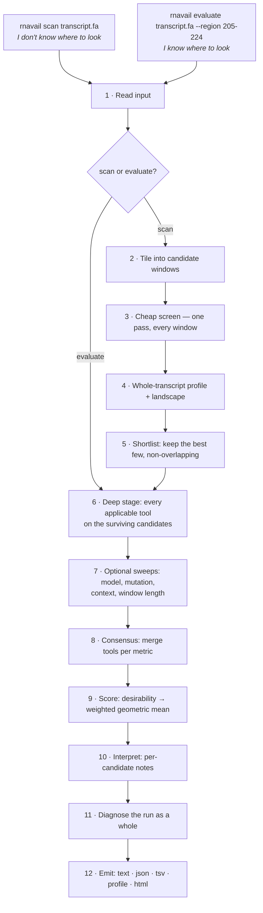

# 2. How it works, end to end

A top-down walk through everything that happens between a FASTA file going in
and a ranked list coming out. Each step names **what** it does, **why**,
**how** (the actual algorithm), what it **costs**, and **where in the code**
it lives.

**In ordinary language:** look everywhere with a fast approximate method,
spend the slower calculations only on a diverse shortlist, keep unlike kinds
of evidence separate, and explain both the rank and the reasons not to trust
it. Timing figures below are measurements from saved runs, not guarantees.

---

## 2.0 The shape of the whole thing

There are two entry points. They converge almost immediately.



The governing principle is a **cost hierarchy**, taken straight from the
source document this project implements: *cheap tools look at everything,
expensive tools look only at what survived.* A transcript has hundreds of
candidate windows and only a handful deserve a partition function each.

- `scan` = steps 1–12. Start from "somewhere in this transcript".
- `evaluate` = steps 1, 6–12. Start from "these specific regions".

`scan` literally calls `evaluate` for its deep stage
([`pipeline/run.py`](../rnavail/pipeline/run.py)).

---

## 2.1 Step 1 — Read the input

**What.** Turn a FASTA path, or a bare sequence typed on the command line,
into a `Sequence` object.

**How.** [`io/fasta.py`](../rnavail/io/fasta.py) → `read_sequence()`. The
`Sequence` constructor ([`core/sequence.py`](../rnavail/core/sequence.py))
normalises aggressively and on purpose:

- whitespace stripped, everything upper-cased
- **T is transcribed to U** — the stored alphabet is always RNA, even for a
  DNA target. `--molecule dna` selects the *energy parameters*, not the
  alphabet, because ViennaRNA's DNA parameter tables also expect U-form input
- non-IUPAC characters raise `SequenceError` immediately rather than folding
  into garbage
- degenerate codes (`N`, `R`, `Y`…) are allowed but flagged: they fold as
  *unpairable*, which silently inflates apparent accessibility, so a warning
  goes into the report

For a multi-record FASTA, `--record NAME` is required. The resolved target's
SHA-256 is recorded in the report, so a probing track and a later rerun can be
checked against the actual sequence that was folded.

`--evidence FILE.json` imports one or more condition-linked annotation tracks
under the same SHA-256 and one-based coordinate convention. The importer
rejects a mismatched sequence or out-of-range record, carries each record into
the report, and marks whether its condition matches the calculation. These
tracks do not alter the structural score: a contact, CLIP peak, modification,
or ribosome record needs target-specific validation before it can be assigned
a directional availability effect.

**Coordinates.** Every region in `rnavail` is **1-based and inclusive at both
ends** — region 5–12 is eight nucleotides and contains both 5 and 12. This
matches ViennaRNA, RNAplfold, and how people write positions in papers. The
conversion to Python's 0-based half-open slicing happens in exactly one
place, `Region.slice()`, so an off-by-one cannot leak into individual
adapters.

**Cost.** Negligible.

---

## 2.2 Step 2 — Tile into candidate windows *(scan only)*

**What.** Cut the transcript into every possible candidate site of the
requested length.

**How.** `tile_regions(length, window, step)`
([`core/sequence.py`](../rnavail/core/sequence.py)). With `--window 20
--step 1` on a 717 nt transcript that is 698 windows: positions 1–20, 2–21,
3–22, … 698–717.

**Why `--window` is a design parameter, not a tuning knob.** The window
length is a statement about *what will bind there* — read it off the
footprint of your oligo, guide or trigger (see the table in
[1.2](01-the-question.md#12-the-practical-problem)). It is not a smoothing
parameter, and the choice genuinely changes the answer: on a real GFP
transcript, the top-15 sites at window length 8 and at window length 20 share
**exactly one site**. The current 25-nt default is only a convenient starting
point near common complementary-binder footprints; it must be replaced by the
actual physical footprint of the intended binder.

**Why `--step 1` is the default and costs nothing.** See step 3 — the
screening engine computes every position in one pass regardless, so a coarser
step throws away resolution you already paid for. Measured on a 717 nt
transcript: 70 windows and 698 windows both take **0.30 s**.

**Cost.** Negligible (it builds a list of coordinate pairs).

**Declared seed coordinates constrain a complementary scan.** With
`--seed-mode fixed` or `listed` for a recognition event whose seed nucleation
is applicable, a tiled window is eligible only if it contains at least one
permitted seed of the requested length. The report records `windows_tiled`,
`windows_excluded_by_recognition`, and `windows_screened`; if none are eligible
it returns a provenance-bearing report with a warning instead of attempting a
meaningless screen. A direct `evaluate` of a complementary footprint with no
permitted fixed/listed placement is rejected before adapters run.

---

## 2.3 Step 3 — The cheap screen

**What.** Get an accessibility number for *every* tiled window in a single
pass.

**Why this step exists at all.** The exact calculation (step 6) costs one
partition function per region. Hundreds of regions × one partition function
each is impractical. RNAplfold's local sliding-window algorithm gets all of
them at once, approximately, in one sweep — it is the only stage in the whole
pipeline that scales to a transcript.

**How.** The `--screen-tool` adapter (default `rnaplfold`) receives a single
`AccessibilityRequest` carrying *all* the windows, and returns a `ToolResult`
holding a `RegionMetrics` per window. Internally
([`adapters/_vienna.py`](../rnavail/adapters/_vienna.py) →
`local_unpaired_matrix`) it slides a window of `--window-size` (default 200
nt) along the molecule, folds each position's neighbourhood, and tabulates
the probability that every stretch of up to `-u` nucleotides ending at each
position is unpaired. That table — indexed by *(end position, stretch
length)* — is the object everything in this step is read out of.

**Failure handling.** If a known screening adapter is unavailable or fails,
`scan` returns a report with its failed or skipped row and a
`screening_failure` detail, but no shortlist or ranked candidates. That makes
the failed prerequisite visible without manufacturing a result. An unknown
screen-tool name is still rejected before a run starts. Every deep-stage tool
also degrades to a visible failed or skipped row instead
([3.4](03-architecture.md#34-the-adapter-contract)).

**Cost.** A historical 717-nt benchmark took about 0.3 s in this environment.
The qualitative scaling is approximately O(n·L²) in transcript length `n` and
maximum pair span `L`; hardware, library version and settings change runtime.

---

## 2.4 Step 4 — Whole-transcript profile and landscape *(scan only)*

**What.** Two whole-transcript views, derived from the same RNAplfold table.

**Why.** That table is indexed by *(position, length)*. The screen reads a
single length out of it and, before this step existed, the rest was computed
and thrown away. Two genuinely useful pictures were sitting in memory
unrendered.

**How.** `_build_profile()`
([`pipeline/run.py`](../rnavail/pipeline/run.py)) computes the table once
via `local_unpaired_matrix`, then:

- **the profile** — `dG_open/nt` for a `--window`-length interval starting at
  *every* position, at single-nucleotide resolution **regardless of
  `--step`**. Stored as `report.detail["profile"]`, written as
  `report.profile.tsv`, drawn as a line plot at the top of the HTML report.
- **the landscape** — the whole *(start position, window length)* surface,
  kept in memory on `report.profile_table` (deliberately *not* serialised to
  JSON, which it would bloat) and rendered as a heatmap by
  [`viz/landscape.py`](../rnavail/viz/landscape.py).

Reading the landscape: a **vertical streak** is a site that stays cheap to
open across many window lengths — a broad, robust element you can target with
almost any footprint. An **isolated fleck** is a site accessible at one
specific length only.

**Cost.** One extra RNAplfold pass (about 0.3 s in the historical 717-nt
benchmark). Skipped with a warning if the ViennaRNA Python bindings are
unavailable.

---

## 2.5 Step 5 — Shortlist *(scan only)*

**What.** Reduce hundreds of screened windows to the `--keep` best, for the
expensive stage.

**How.** `_shortlist()` ([`pipeline/run.py`](../rnavail/pipeline/run.py)):

1. For complementary recognition classes, sort every screened window by
   **seed accessibility first** (`seed_p_unpaired`), then by opening cost per
   nucleotide as a tiebreak. The default unspecified class retains this as an
   explicitly labelled exploratory assumption.
2. For `protein`, `small_molecule`, `custom`, and unrecognised named classes,
   sort by opening cost per nucleotide only. Their raw seed readings remain
   diagnostic, but do not define the shortlist.
3. Walk that order greedily, keeping a window only if it does **not overlap**
   anything already kept, until `--keep` are chosen.

**Why seed first when a complementary mechanism is declared.** A site that
cannot nucleate cannot be rescued by anything downstream, whereas a high
full-site opening cost is sometimes tolerable if the seed itself opens reliably
([1.5](01-the-question.md#15-nucleation-why-a-buried-site-can-still-work)).
That mechanism is not assumed for protein or small-molecule recognition.

**Why non-overlapping.** Without it, the top ten would be ten one-base shifts
of the same loop. The cost of this choice is that the reported boundaries are
one arbitrary slice of what may be a broad accessible plateau — which is
exactly what the landscape plot from step 4 lets you see around it.

**Cost.** Negligible (a sort and a sweep).

---

## 2.6 Step 6 — The deep stage

**What.** Run every applicable tool over the surviving candidates. This is
where `evaluate` starts.

**How.** `evaluate()` ([`pipeline/run.py`](../rnavail/pipeline/run.py))
builds one `AccessibilityRequest` — sequence, regions, model settings,
recognition event, experimental condition, optional probing data, and seed
length — and hands the *same* request to every adapter that `select()`
returns:

```python
for adapter in select(names=tools, max_cost=max_cost):
    report.tool_results.append(adapter.run_accessibility(access_request))
```

Adapters are ordered by tier, then cost, then name, so cheap accessibility
tools run before expensive structure tools. `--tools` picks an explicit
subset; `--max-cost` sets a runtime ceiling.

Every adapter receives the same requested event and reports into the same
metric vocabulary
([3.3](03-architecture.md#33-the-metric-vocabulary)). One request in, twelve
adapter readings out, with model lineage and compatibility tracked separately.
What each tool actually computes is
[4. The tools](04-tools.md).

The request makes the intended event reviewable. `RecognitionSpec` records
the binder and partner description, orientation, endpoint, and whether a
seed may start anywhere, at one terminus, or only at fixed/listed coordinates.
Those placement rules constrain the seed scan. The current structural layer
does **not** calculate partner hybridisation, concentrations, cleavage, or a
cellular endpoint; such fields are retained as declared assumptions and are
flagged when they are outside the target-RNA secondary-structure model.

`ConditionSpec` records temperature, salts, divalent-ion and pH fields,
preparation, crowding, partner concentration, and cellular context. Its
temperature and sodium concentration must match `ModelSettings.temperature_c`
and `ModelSettings.salt_molar`, respectively, so the report cannot describe a
different temperature or monovalent salt condition from the one folded.
Compatible adapters can apply that salt setting; fields with no implementation
in the secondary-structure layer remain explicitly recorded as unsupported
rather than silently changing the interpretation of a result.

When `--shape` is supplied, the reader validates positions, duplicate rows,
base identities (when supplied), finite reactivities, the source hash, and
the target sequence hash. The report records chemistry, conversion,
conversion parameters, coverage, source and sequence hashes, and condition
identity. DMS requires an explicit `--shape-method`; rnavail does not assume
that a SHAPE conversion is valid for it. Each tool labels the track as
`applied`, `unsupported`, or `not_applicable`, and records which model
settings it actually applied or could not apply.

**Local and global scope are separate settings.** `--max-bp-span` and
`--window-size` describe the local RNAplfold screen. Whole-sequence adapters
are unrestricted by default; `--global-max-bp-span` is the separate opt-in
limit for them. The distinction is carried in the protocol signature, for
example `…/L150/W200/GLall`, so a local approximation is never accidentally
presented as a globally span-limited fold.

**Critically: one tool failing costs one row, not the run.**
`run_accessibility()` wraps the call and converts any exception into a
`failed` `ToolResult` carrying the error message. A missing binary becomes a
`skipped` row with a fix hint. The report tells you what ran, what failed,
and why.

**Cost.** The dominant stage. One historical 717-nt run with ten candidates
showed roughly 55 s of whole-molecule work plus roughly 7 s per candidate.
Treat this only as an order-of-magnitude example; adapter versions, sequence,
settings and hardware matter.

---

## 2.7 Step 7 — The optional sweeps

Four opt-in passes that ask *how much should you trust the number you just
got?* Each perturbs one thing and reports the resulting spread.

| Flag | Perturbs | Metric produced | Scored? |
|---|---|---|---|
| `--robustness` | the folding **model** | `dg_open_spread` | yes, weight 0.75 |
| `--length-robustness` | the **window length** | `window_length_spread` | yes, weight 0.75 |
| `--ribosnitch` | the **sequence** (point mutants) | `ribosnitch_spread` | no, diagnostic |
| `--context-robustness` | the **flanking context** | `context_dg_spread` | no, diagnostic |

### `--robustness` — is this an artefact of the model?

`_robustness_sweep()` re-screens every candidate under seven folding
protocols and reports the range of `dG_open`:

```
T37/turner2004/d2/L150/W200/GLall the baseline
T32/…  T42/…                     ±5 °C
…/d0/…                           dangling-end model flipped
…/noLP                           lonely pairs disallowed
…/L300/W300   …/L75/W80          pair span doubled / halved
```

Each variant changes one assumption that is *genuinely uncertain* rather than
merely arbitrary. It also records **rank stability** — how much each
candidate's position in the ranking moves across the seven runs.

### `--length-robustness` — is this an artefact of the window length?

`_length_sweep()` refolds each candidate at its own length ±3 and ±6 nt
(start held fixed) and reports the spread in `dG_open/nt`. All variants for a
candidate use one enclosing local context, so the comparison changes the
footprint rather than also changing which flanking bases are folded. Opening
cost per nucleotide is **not monotonic** in length — it tracks which helices
the boundary happens to fall across, a step function, not a smooth trend — so
a site that looks cheap at exactly one length is a narrower bet than one that
holds up nearby.

### `--ribosnitch` — is this an artefact of *this exact sequence*?

`_ribosnitch_scan()` folds **every single-point mutant** of each region — all
three substitutions at every position — and reports how far one change can
move `dG_open`, naming the worst offender. A natural SNP, a sequencing error
or a codon-optimisation choice is a point mutation; if one of them swings the
answer by kcal/mol, the site is a *riboSNitch* candidate and its ranking is
fragile in a way no amount of re-running the same tool would reveal.

It deliberately **ignores any `--shape` data**: reactivity was measured on the
real, unmutated molecule, and carrying it over onto a hypothetical mutant
unchanged would be dishonest.

### `--context-robustness` — is this an artefact of where I cut the FASTA?

`_context_sweep()` refolds each region with flanks of 0, 30, 75, 150, 300 nt
and the whole remaining sequence, and reports the spread. Every adapter folds
whatever sequence it is handed, in full — where you cut the file is a
modelling choice nothing else checks. On the GFP transcript this reached
**8.5 kcal/mol** for some candidates.

### One shared caveat, stated in the report

All three sequence sweeps fold a **±100 nt local context** rather than the
whole molecule, to keep cost bounded independent of transcript length. Their
spreads are internally consistent with each other but **not directly
comparable in magnitude** to the headline `dG_open`, which is folded on the
whole sequence. A run using any of them emits that warning once, automatically.

---

## 2.8 Step 8 — Consensus

**What.** Twelve tools have each produced their own numbers. Merge them into
one value per metric per candidate.

**How.** `build_consensus()`
([`pipeline/score.py`](../rnavail/pipeline/score.py)) collects every metric
every tool reported for a region. Then `Consensus` applies **four gates**
before taking a median, because *"every tool that reported it" is not the
same as "every compatible measurement of it"*:

1. **De-duplication by shared calculation.** `rnaplfold` and
   `rnaplfold-cli` are the same algorithm run through two interfaces — a
   validation pair, not two votes. `vienna-exact`, `rnafold`, and
   `ensemble-sample` likewise share the `vienna-global-pf` model family;
   sampling is a numerical/state-inspection check, not another biological
   replicate. Its Monte Carlo value stays raw-only when an exact probability
   from that ensemble is available, rather than being averaged into it.
2. **Estimand gating.** A Boltzmann probability, a trained model's posterior,
   and one deterministic structure's binary call are not the same kind of
   number. Exact probability-estimand tools feed the primary median; Monte
   Carlo, posterior, and single-structure values are kept and shown, never
   silently dropped. A compatible non-exact value can be the fallback only
   when no exact probability is available.
3. **Conditioning gate.** If probing data were requested, a tool that cannot
   apply that conversion is excluded from the conditioned consensus. Results
   with a different applied probing-track identity are excluded as well. The
   raw rows remain in the report with their conditioning status.
4. **Protocol-compatibility gate.** A probability result whose adapter
   declares material requested settings as unsupported is retained as a raw
   diagnostic, but is excluded from the compatible probability median. The
   reason appears in `excluded_for_protocol`.

`flatten_metrics()` then reduces each `Consensus` to a single representative
value — the **median**, not the mean, so one misconfigured tool cannot drag
the answer. It remains useful for cross-tool sensitivity, but it is not used
to make a hybrid opening event: `P_unpaired`, `dG_open`, and the selected seed
shown for a candidate come from one coherent primary observation. That
observation retains its tool, interval, temperature, scope, conditioning,
and any bound or censoring reason.

The full logic, with the evidence behind it, is
[5. Consensus and scoring](05-consensus-and-scoring.md).

---

## 2.9 Step 9 — Score

**What.** Turn a bag of structural measurements into a transparent
**heuristic rank score**.

**How.** Two stages, in `score_candidate()`
([`pipeline/score.py`](../rnavail/pipeline/score.py)):

1. **Desirability.** Each scored metric is mapped onto [0, 1] through a ramp
   with **absolute anchors** — so a candidate's score does not change when
   you add or remove other candidates from the run.
2. **Weighted geometric mean** of those desirabilities.

Only **four** of the 24 currently defined metric keys can feed the default
score, and a particular run usually produces only a subset. The rest are
diagnostic. That is deliberate and is explained in
[5.4](05-consensus-and-scoring.md#54-what-is-scored-and-what-is-only-reported).

The score is an uncalibrated aid for ranking structural candidates. It is not
a probability of binding, cleavage, repression, or cellular function.
`P_unpaired` remains a primary reported observation, but is deliberately not
scored alongside `dG_open/nt`, because they are deterministic transforms of
the same interval-opening event.

The mean is geometric rather than arithmetic because active ranking
preferences are **conjunctive**: a complementary target needs a cheap opening
cost, an accessible seed, and a stable answer at once. A geometric mean lets
one near-zero factor sink the rank instead of letting other favorable features
conceal it. For a non-complementary recognition class, seed criteria are
excluded and the report labels the remaining structural rank as neither a
binding-affinity prediction nor a mechanism-specific score.

**Coverage.** Every score carries the fraction of the intended scoring weight
that actually had data behind it. Criteria whose metric is missing are
*dropped* from the mean rather than scored zero — a candidate is never
punished for a tool you chose not to run — but the report says how thin the
basis was.

---

## 2.10 Step 10 — Interpret

**What.** Turn the numbers into the handful of sentences worth reading.

**How.** `_interpret()` ([`pipeline/run.py`](../rnavail/pipeline/run.py))
checks each candidate against a list of specific, named failure modes and
emits a plain-English note for each one that fires. These are diagnoses, not
decoration — each names something that changes what you would do next:

- **seed-vs-site mismatch** → a toehold-style design is plausible where a
  full-footprint one is not
- **per-base vs joint mismatch** → the mean is overstating availability
- **unstable across model settings / window length** → the ranking is
  provisional
- **riboSNitch candidate** → names the exact worst mutation
- **context-sensitive** → confirm the modelled context matches the construct
- **pseudoknot disagreement** → every other number here may be optimistic
- **quadruplex propensity** → structure no folding engine here represents
- **co-transcriptional trap** → names the transcript length at which the site
  locks shut
- **windowed-vs-exact gap** → a local/global protocol disagreement worth
  inspecting; it can be consistent with long-range pairing, but does not by
  itself prove a cause or identify a trusted calculation
- **thin estimator set** → this candidate was measured by fewer tools than
  its neighbours

---

## 2.11 Step 11 — Diagnose the run as a whole

**What.** Two checks that no single candidate's numbers can reveal, because
both need every candidate scored first.

**How.** `_diagnose_run()`
([`pipeline/run.py`](../rnavail/pipeline/run.py)):

- **Score saturation.** If a scoring criterion is pinned at an anchor
  (desirability within 0.02 of 0 or 1) for at least half the run's
  candidates, it is not discriminating between them, whatever its weight
  implies — and a warning says so. This check follows the active criteria, so
  it can identify a saturated seed or opening-cost term without treating a
  reported-but-unscored probability as a scoring feature.
- **Estimator dropout.** A compatible estimator can fail to produce a point
  estimate for the hardest candidates (for example, a zero-hit sampling run
  reports an upper bound). A candidate whose primary statistic rests on fewer
  declared calculation groups than its neighbours gets a note, because it is
  not a like-for-like comparison. Sampling does not alter an exact value from
  the same global ensemble when both are available.

---

## 2.12 Step 12 — Emit

| Output | Written by | Contains |
|---|---|---|
| terminal / `report.txt` | `to_text()` | ranked table, notes, warnings; `-v` adds score components and cross-tool agreement |
| `report.json` | `to_json()` | schema 2.0: sequence SHA-256, recognition/condition/probing provenance, every raw tool row, applied protocol and conditioning, consensus, coherent opening observations, heuristic-score derivation, and run detail |
| `report.tsv` | `to_tsv()` | one row per candidate, every metric — for spreadsheets and downstream analysis |
| `report.profile.tsv` | `to_profile_tsv()` | one row per **position**: the whole-transcript accessibility track (scan only) |
| `report.html` | `to_html()` | the visual report — profile, landscape, per-candidate cards with heatmaps and 2D structures |
| `meta.json` | `write_meta()` | exact command line, inputs, protocol, which tools ran/failed, duration |

`--save-run` writes all of them into a timestamped directory and updates a
`runs/latest` symlink. Two runs in the same second get a numeric suffix
rather than one clobbering the other.

Details in [6. Reading the output](06-outputs.md).

---

**Next:** [3. Architecture](03-architecture.md) — the components behind these
steps and how they connect.
