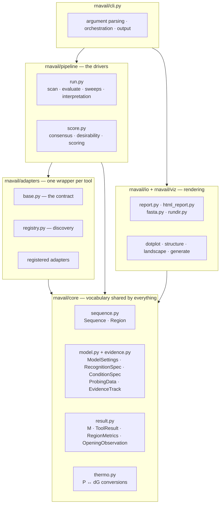
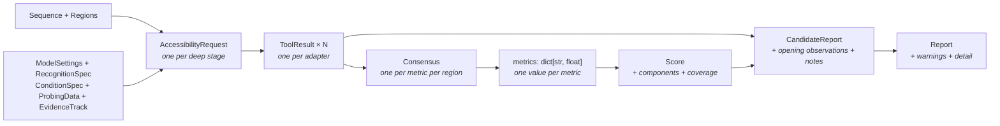

# 3. Architecture — the components and how they connect

[2. Pipeline](02-pipeline.md) describes *what happens*. This describes *what
the pieces are*, why they are separated the way they are, and how data moves
between them.

---

## 3.1 The layer cake



The dependency arrows only ever point **downward**, and that is the design:

- **`core/` knows about nothing.** It defines the shared vocabulary — what a
  sequence is, what a region is, what a metric is called, how to convert a
  probability to an energy. Everything imports it; it imports nothing back.
- **`adapters/` know about `core/` only.** An adapter has no idea that
  scoring exists, how many other adapters there are, or what a report looks
  like. It answers one question and reports into the shared vocabulary.
- **`pipeline/` orchestrates adapters and scores their output.** It does not
  know how any individual tool works — only that every adapter honours the
  same contract.
- **`io/` and `viz/` render.** They read finished objects. `viz/generate.py`
  even re-folds its own local window rather than reaching into pipeline
  results, because a heatmap needs the full base-pair probability matrix that
  no adapter keeps around.

The payoff: **adding another tool touches exactly one new file.** It
requires no change to scoring, reporting, the CLI, or any other adapter.

---

## 3.2 The data structures

The core objects carry the requested event, its provenance, and the resulting
measurements. Following one candidate through them is the clearest way to see
the whole system.



### `Sequence` and `Region` — [`core/sequence.py`](../rnavail/core/sequence.py)

`Sequence` is an immutable, normalised nucleic acid: always upper-case,
always the RNA alphabet, with `molecule` selecting the energy parameters
rather than the letters. It exposes `gc_fraction`, `has_ambiguous`, and
`as_dna()`, plus a SHA-256 used to bind a report and a probing track to the
same target sequence.

`Region` is a **1-based, inclusive-on-both-ends** interval. It is the single
place coordinate arithmetic lives:

| Method | Purpose |
|---|---|
| `slice(seq)` | extract the subsequence — the only 1-based → 0-based conversion in the codebase |
| `positions()` | iterate the covered positions |
| `overlaps(other)` | used by shortlisting |
| `with_flanks(up, down, limit)` | expand by context, clipped at the sequence ends |
| `to_local(context)` | re-express in coordinates local to a folded window |
| `shifted(offset)` | translate |

`parse_region()` accepts `205-224`, `name:205-224`, or a literal subsequence
which it locates in the parent (refusing ambiguously repeated matches).

### `RecognitionSpec` and `ConditionSpec` — [`core/model.py`](../rnavail/core/model.py)

`RecognitionSpec` states what accessibility is meant to stand for: binder
class, optional partner sequence and chemistry, orientation, declared
endpoint, seed length, and allowed seed placements. A seed can be scanned at
any internal start, restricted to the 5′ or 3′ end, or fixed/listed at
specific one-based positions. For a recognition event with applicable seed
nucleation, a direct evaluation with no valid fixed/listed placement fails
before an adapter can emit a partial row; a scan filters those ineligible tiled
windows and records the exclusion. Non-complementary binders keep fixed/listed
seed coordinates only as diagnostics. The current implementation supports one
seed length per calculation. Adapters retain the ordered trial
list for every permitted seed start in regional detail, including censored,
unavailable, or exact-budget-skipped trials, so a selected seed cannot be
mistaken for an exhaustive unrecorded search.

Explicit complementary classes use seed accessibility for the shortlist and
rank. `protein`, `small_molecule`, `custom`, and unrecognised named classes
mark seed nucleation `not_applicable`: raw seed values remain diagnostics, but
seed-derived criteria are removed and scan shortlisting uses opening cost.
The default `unspecified` class preserves seed use as an `exploratory`
assumption. `detail["recognition_scoring"]` records the status, shortlist
order, active criteria, and excluded criteria for every run.

This is a description of the recognition event, not an interaction engine.
Partner hybridisation, partner concentration, kinetic competition, cleavage,
and cellular function are not calculated by the target-RNA
secondary-structure layer. If supplied, they are preserved as report
assumptions and called out as unsupported rather than being mistaken for a
modelled effect.

`ConditionSpec` stores temperature; monovalent, potassium, and magnesium
fields; pH; incubation and preparation; crowding; partner concentration; and
optional organism, cell type, and compartment. It requires the declared
temperature **and sodium concentration** to match `ModelSettings`. The
monovalent folding salt setting can reach compatible adapters. Other
environmental fields currently have no secondary-structure implementation and appear in
`detail["unsupported_assumptions"]` instead of being silently ignored.

### `ModelSettings` — [`core/model.py`](../rnavail/core/model.py)

Every parameter that changes a folding free energy, frozen in one object:
temperature, parameter set, dangling-end model, lonely pairs, GU pairs,
G-quadruplexes, circularity, salt, local base-pair span, global base-pair
span, and local window size.

Why one object matters more than it looks: accessibility numbers are only
comparable between candidates when every candidate was folded under an
*identical protocol*. Passing the same `ModelSettings` to every adapter is
what makes the final ranking mean anything. `signature()` renders it as a
short string (`T37/turner2004/d2/L150/W200/GLall`) that appears in every
report header, so a run's protocol is never in doubt.

`max_bp_span` and `window_size` apply only to local/window calculations such
as RNAplfold. Whole-sequence calculations use `global_max_bp_span`, which is
unrestricted (`GLall`) by default. A finite global limit is an explicit
modelling choice, never an accidental inheritance of the screening limit.

`variants()` yields the seven perturbed protocols the `--robustness` sweep
uses.

`ProbingData` holds SHAPE/DMS reactivities, 1-based and parallel to the
sequence, where **`None` means "not measured"** and is preserved as such all
the way into ViennaRNA's `-999` convention. An absent measurement is not
evidence of an unpaired base. It also carries assay chemistry, conversion
method and parameters, condition ID, source hash, target sequence hash, and
whether the conversion was explicitly selected. Its stable conditioning ID
identifies the exact track and conversion used by a compatible adapter.

### `ToolResult` and `RegionMetrics` — [`core/result.py`](../rnavail/core/result.py)

What one adapter produced in one invocation:

```python
ToolResult(
    tool="vienna-exact",            # which adapter
    tier=Tier.ACCESSIBILITY,        # pipeline stage
    status="ok",                    # ok | skipped | failed
    regions={"427-446": RegionMetrics(...)},   # per-region numbers
    globals={...},                  # whole-molecule numbers
    warnings=[...], error="",       # honest failure reporting
    runtime_s=1.7,
    independence_group="vienna-global-pf", # see §3.5
    estimand="probability",              # see §3.5
    conditioning={"status": "applied", ...},
    applied_protocol={"requested": {...}, "applied": {...}, ...},
)
```

`conditioning` says whether a requested probing conversion was `applied`,
`unsupported`, `not_applicable`, or `not_requested`, and carries the track
identity where relevant. `applied_protocol` separates requested settings from
the settings an adapter applied, rejected as unsupported, or ignores by
design. This prevents a report from implying that every adapter implemented
every requested setting. Its `compatible_with_requested` flag is false when
an unsupported setting is material; such probability results remain visible
but do not enter the compatible consensus.

`RegionMetrics.set()` does not serialise non-finite numbers as `NaN` or
infinity. It records the numerical status in the metric detail and leaves the
metric absent, so the scorer can handle an unavailable value without
poisoning JSON or hiding why it was omitted.

### `Consensus` and `Score` — [`pipeline/score.py`](../rnavail/pipeline/score.py)

`Consensus` is one metric as reported by every tool that produced it, plus
the machinery to combine them correctly ([5.1](05-consensus-and-scoring.md)).
`Score` is an uncalibrated heuristic rank with its full derivation attached —
every component, its desirability, its weight, and what was missing.

### `CandidateReport` and `Report` — [`pipeline/run.py`](../rnavail/pipeline/run.py)

`CandidateReport` is everything known about one region: its consensus,
flattened metrics, heuristic rank, notes, and `OpeningObservation` records.
Each observation keeps a probability and opening energy from one tool and
protocol together with interval, temperature, algorithm, sequence scope,
conditioning ID, seed, and any bound/censoring reason. A deterministic
primary observation supplies the candidate's linked headline opening fields;
the consensus remains available to show cross-tool sensitivity without
creating a probability/energy hybrid.

`Report` is the whole run: every candidate, every `ToolResult`, run-level
warnings, recognition and condition specifications, optional probing
provenance, and validated `EvidenceTrack` overlays. A candidate carries only
the overlapping records in `biological_evidence`, labeled as matched,
different-condition, or unverified annotations; these do not alter its rank.
The run-level `detail` dict holds sweep traces, the accessibility
profile, saturation statistics, assumptions that were not modelled, and
timings. `to_dict()` labels this record `report_schema_version: "2.0"`.
The root sequence object and `detail["sequence_sha256"]` bind that record to
the folded sequence; probing provenance includes its source and target hashes.

`Report.profile_table` is the one deliberate exception to "everything is
serialisable": it holds RNAplfold's raw table in memory for the landscape
plot and is excluded from `to_dict()`, because serialising it would bloat
`report.json` by hundreds of kilobytes for something only the renderer wants.

---

## 3.3 The metric vocabulary

Every adapter, whatever it wraps, reports into the same small namespace of
metric names — class `M` in [`core/result.py`](../rnavail/core/result.py).
That is the single decision that makes it possible to compare RNAplfold
against RNAstructure against CONTRAfold without special-casing each tool.

| Group | Metrics |
|---|---|
| **Joint accessibility** (the core) | `p_unpaired` · `dg_open` · `dg_open_per_nt` |
| **Nucleation seed** | `seed_p_unpaired` · `seed_dg_open` · `seed_start` · `seed_length` |
| **Per-base descriptors** *(diagnostic only)* | `mean_base_unpaired` · `min_base_unpaired` · `paired_fraction` · `shannon_entropy` |
| **Global structure** | `mfe` · `ensemble_free_energy` · `mfe_ensemble_gap` · `mean_bp_distance` |
| **Robustness (model)** | `dg_open_spread` · `rank_stability` |
| **Robustness (sequence)** | `ribosnitch_spread` · `context_dg_spread` · `window_length_spread` |
| **Beyond nested structure** | `gquad_score` · `pseudoknot_paired_fraction` |
| **Kinetics** | `co_tx_trap_length` |
| **Engine disagreement** | `window_exact_gap` |

Two frozen sets, `HIGHER_IS_BETTER` and `LOWER_IS_BETTER`, record the sign
convention so nothing downstream has to guess whether a big number is good.
Metrics in neither set are purely descriptive (`seed_start` is a position;
`window_exact_gap`'s sign carries information a desirability curve would
throw away).

---

## 3.4 The adapter contract

Every tool wrapper subclasses `Adapter`
([`adapters/base.py`](../rnavail/adapters/base.py)) and must be honest about
two things.

**1. Can it run here?** `availability()` returns `Availability.yes(version)`
or `Availability.no(reason, hint)`. A missing binary costs the report one
row, with a fix hint, rather than crashing the run.

**2. Did it work?** `run_accessibility()` wraps `compute_accessibility()` in
a try/except and converts any exception into a `failed` `ToolResult` carrying
the error. One broken tool never costs you the other ten.

```python
@register
class MyAdapter(AccessibilityAdapter):
    name = "mytool"
    tier = Tier.ACCESSIBILITY
    cost = 2
    provides = (M.P_UNPAIRED, M.DG_OPEN)

    def availability(self):
        return Availability.yes() if find_binary("mytool") else \
               Availability.no("mytool not found", hint="conda install mytool")

    def compute_accessibility(self, request):
        result = self.new_result(request.settings)
        for region in request.regions:
            result.region_metrics(region).set(M.P_UNPAIRED, ...)
        return result
```

Class attributes that matter:

| Attribute | Meaning |
|---|---|
| `name` | stable identifier used on the command line and in reports |
| `tier` | `ACCESSIBILITY` (runs first) or `STRUCTURE` |
| `cost` | rough runtime class; orders execution, and `--max-cost` filters on it |
| `provides` | which metrics it can emit |
| `independence_group` | shared with any tool that is the *same calculation* — see below |
| `estimand` | what *kind* of number its per-base metrics are — see below |
| `orthogonal` | informational: a different model class from thermodynamic folding |
| `probing_methods` | probing conversions the adapter can apply to its calculation |
| `probing_irrelevant` | a sequence-only diagnostic remains meaningful but has no probing-conditioned value |
| `model_family` / `algorithm` | provenance labels carried into each opening observation |
| `applied_setting_names` | settings the adapter declares it applies; the rest are visible as unsupported or ignored |
| `ignored_setting_names` | settings deliberately immaterial to this adapter's declared calculation |

**`registry.py`** discovers adapters by importing every module in the package
so the `@register` decorator fires, then `select()` filters by name, tier,
cost and availability, ordering by `(tier, cost, name)`.

---

## 3.5 Independence groups, estimands, and conditioning

These two attributes exist because a naive "average across all tools" is
wrong in two distinct ways. Both are covered in depth in
[5. Consensus and scoring](05-consensus-and-scoring.md); here is what they
*are*.

**`independence_group`** — tools that are the same calculation reached two
ways:

| Group | Members | Why |
|---|---|---|
| `vienna-rnaplfold` | `rnaplfold`, `rnaplfold-cli` | identical windowed algorithm, Python bindings vs. the stock binary; the test suite asserts they agree to 0.01 kcal/mol |
| `vienna-global-pf` | `vienna-exact`, `rnafold`, `ensemble-sample` | whole-sequence ViennaRNA partition-function family; sampling checks numerical/state behavior under the same model rather than supplying an independent biological replicate |
| `rnastructure` | `probknot`, `rnastructure-partition` | ProbKnot is built on RNAstructure's own partition function — same codebase, same parameter tables |

Everything else defaults to its own name, i.e. its own singleton group. The
field name `n_independent` in current reports means distinct declared
calculation groups, not independent biological measurements.

**`estimand`** — what kind of number a per-base metric is:

| Value | Adapters | Meaning |
|---|---|---|
| `probability` (default) | `rnaplfold`, `rnaplfold-cli`, `vienna-exact`, `rnafold`, `rnastructure-partition` | an exact dynamic-programming Boltzmann/partition-function probability |
| `monte_carlo_probability` | `ensemble-sample` | sampled estimate of the same ViennaRNA ensemble; diagnostic when an exact probability is available, compatible fallback when it is not |
| `posterior` | `contrafold`, `eternafold` | a trained model's confidence — explicitly *not* a thermodynamic probability |
| `single_structure` | `linearfold`, `probknot`, `kinwalker` | one deterministic structure's binary call, quantised to multiples of 1/length |

**Conditioning** — a probing track is not a decorative annotation. With a
track, adapters that apply the requested conversion receive its stable
conditioning ID. Adapters that cannot apply it are reported but excluded from
the conditioned consensus; sequence-only diagnostics can be marked
`not_applicable`. The report also records an API-supplied track whose target
sequence hash is missing as `unverified`. This keeps a soft-constrained fold
from being silently averaged with an unconditioned one. Separately, a
probability result that declares any material requested model setting
unsupported is excluded from the compatible consensus and named in
`excluded_for_protocol`.

---

## 3.6 Where each question is answered in the code

| If you want to know… | Look at |
|---|---|
| how a FASTA becomes a `Sequence` | [`io/fasta.py`](../rnavail/io/fasta.py) |
| what a region *is*, and coordinate handling | [`core/sequence.py`](../rnavail/core/sequence.py) |
| what changes a folding energy | [`core/model.py`](../rnavail/core/model.py) |
| how P and dG convert | [`core/thermo.py`](../rnavail/core/thermo.py) |
| what metrics exist | [`core/result.py`](../rnavail/core/result.py) |
| how a tool is wrapped | [`adapters/base.py`](../rnavail/adapters/base.py) |
| shared ViennaRNA plumbing | [`adapters/_vienna.py`](../rnavail/adapters/_vienna.py) |
| finding and running external binaries | [`adapters/external.py`](../rnavail/adapters/external.py) |
| the scan/evaluate drivers and all four sweeps | [`pipeline/run.py`](../rnavail/pipeline/run.py) |
| combining tools, and the scoring maths | [`pipeline/score.py`](../rnavail/pipeline/score.py) |
| text / JSON / TSV output | [`io/report.py`](../rnavail/io/report.py) |
| the HTML report | [`io/html_report.py`](../rnavail/io/html_report.py) |
| run directories and `runs/latest` | [`io/rundir.py`](../rnavail/io/rundir.py) |
| heatmaps, structures, profile, landscape | [`viz/`](../rnavail/viz/) |
| the command line | [`cli.py`](../rnavail/cli.py) |

---

## 3.7 Two safety rails worth knowing about

Both exist because a C library segfaulted or hung rather than raising, and a
silent crash is worse than a failed row.

**G-quadruplexes plus windowed folding.** ViennaRNA's local/window partition
function does not implement quadruplex folding and **segfaults the whole
process** when the two are combined. `local_unpaired_matrix()` raises a normal
Python `ValueError` before the call can reach the C library, so `--gquad`
with a windowed engine degrades to one failed adapter instead of killing the
interpreter. Regression-tested.

**kinwalker's runtime.** Measured in this environment: 100 nt → 7.5 s, 140 nt
→ 17.7 s, 150 nt → did not finish in 30 s. Since it runs by default and folds
the whole molecule, a transcript-length target would hang every default run.
The adapter refuses above 140 nt with a clear message and an
`options={"kinwalker_max_length": N}` escape hatch.

---

**Next:** [4. The tools](04-tools.md) — what each of the twelve adapters
actually computes.
