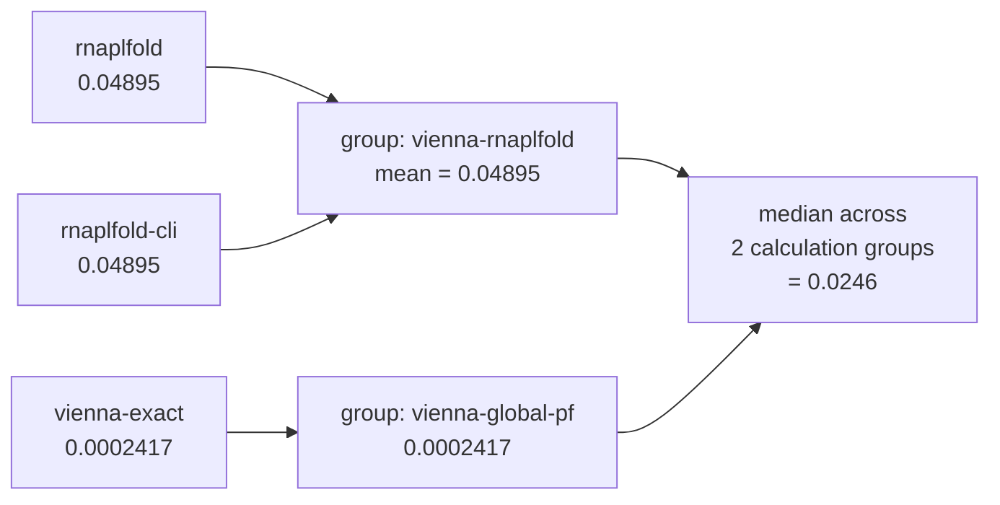

# 5. Consensus and scoring

The available tools have each produced their own numbers for the same region.
This is how they become one value per metric, and then one transparent
heuristic number to rank on — and, just as importantly, which parts of that
process are deliberately *not* automatic.

Everything here lives in
[`pipeline/score.py`](../rnavail/pipeline/score.py).

**Plain-language summary.** First avoid comparisons that mix unlike
quantities. Then summarize genuinely comparable calculations. Finally map at
most four structural preferences to 0–1 and combine them. The resulting rank
orders candidates; it is not the probability that an experiment will work.

---

## 5.1 Four gates before any averaging

The obvious thing to do is take the median across every tool that reported a
metric. That is wrong in several distinct ways: shared calculations,
incompatible estimands, different probing conditioning, and unsupported
material settings do not answer the same question.

The governing principle:

> **"Every tool that reported it" is not the same as "every compatible
> calculation of it."**

### Correction 1 — de-duplication by shared calculation group

`rnaplfold` (the ViennaRNA Python bindings) and `rnaplfold-cli` (the stock
RNAplfold binary) run the **same algorithm through two interfaces**. The test
suite asserts they agree to 0.01 kcal/mol — that agreement is the *point* of
having both; it validates that we drive the bindings correctly.

Counting them as two votes is therefore a category error, and with only three
or four tools reporting a metric it is a consequential one: two identical
values **pin the median**.

Here is what that did on the real GFP transcript, before the fix:

| Region | `rnaplfold` | `rnaplfold-cli` | `vienna-exact` | old median | disagreement |
|---|---|---|---|---|---|
| w457 | 0.04895 | 0.04895 | 0.0002417 | **0.04895** | 203× |
| w219 | 0.0003686 | 0.0003686 | 8.069 × 10⁻⁷ | **0.0003686** | 457× |
| w313 | 0.03745 | 0.03745 | 0.0001969 | **0.03745** | 190× |

Three things make this worse than a generic averaging complaint:

1. The median landed on the duplicated value **every time**.
2. The local and global calculations use different sequence scopes, so a
   disagreement is scientific information rather than a reason to let a
   duplicated interface decide the answer.
3. A median across redundant values can conceal that disagreement instead of
   showing it to the person choosing a target.

**The fix.** Each adapter declares an `independence_group`. Tools sharing one
are averaged into a single value *before* the cross-group median is taken:



Current groups include `vienna-rnaplfold` (`rnaplfold` +
`rnaplfold-cli`), `vienna-global-pf` (`vienna-exact`, `rnafold`, and
`ensemble-sample`), and `rnastructure` (`probknot` +
`rnastructure-partition`, which share a codebase and parameter tables).
The global Vienna group means that sampling provides a numerical and
state-population check on the same physical model; it is not an independent
biological replicate. Everything else is its own singleton.

The report shows the raw, compatible, and grouped counts so the distinction is visible rather than
internal:

```
dg_open: median 3.584 kcal/mol across 2 compatible calculation groups from 3
          primary values; 3 raw tools reported
         (spread 3.145) [rnaplfold=2.012, rnaplfold-cli=2.012, vienna-exact=5.156]
```

### Correction 2 — estimand gating

For per-base metrics like `mean_base_unpaired`, up to eight tools report a
number — but they are not the same *kind* of number:

| Kind | Tools | What the number is |
|---|---|---|
| `probability` | `rnafold`, `rnaplfold`, `rnastructure-partition`, `vienna-exact` | an exact dynamic-programming Boltzmann/partition-function probability |
| `monte_carlo_probability` | `ensemble-sample` | sampled estimate of the same ViennaRNA ensemble; shown as a numerical/state check rather than averaged into an exact value |
| `posterior` | `contrafold`, `eternafold` | a trained model's confidence — neither adapter converts it to a free energy |
| `single_structure` | `linearfold`, `probknot`, `kinwalker` | one deterministic structure's binary call, quantised to multiples of 1/length |

Taking a median across all eight treats "probability", "model confidence" and
"binary in one structure" as interchangeable. It shows up most sharply in
`min_base_unpaired`, where `probknot` contributes exactly **0** whenever any
single base in the window is paired in its structure — a value categorically
different from a probability, sitting in a median with probabilities.

**The fix.** Only `probability`-estimand tools feed the primary median. The
others are **kept and shown, never silently dropped**. In particular, a
Monte Carlo sample of the same ensemble does not perturb a dynamic-programming
value; it becomes a compatible fallback only if no exact probability exists:

```
mean_base_unpaired: median 0.3992 across 4 independent measurements, 8 tools
    [contrafold=0.7177, eternafold=0.6822, ensemble-sample=0.3596,
     linearfold=0.5, probknot=0.65, rnafold=0.3616, rnaplfold=0.6579,
     rnastructure-partition=0.4368]
    not blended into the median (different estimand): ensemble-sample
    (monte_carlo_probability), contrafold (posterior),
    eternafold (posterior), linearfold (single_structure),
    probknot (single_structure)
```

There is a deliberate compatible-only fallback: if *no* tool reporting a
metric is `probability`-estimand, compatible alternative estimands are used,
so a metric reported only by e.g. LinearFold or sampling still shows a number
rather than silently vanishing.

### Correction 3 — conditioning provenance

Experimental probing changes the calculation only for adapters that know how
to apply the requested conversion. When a probing track is present, each raw
tool row records whether that conversion was `applied`, `unsupported`, or
`not_applicable`, plus a stable identity for the applied track and conversion.
An unsupported result is retained as a diagnostic row but excluded from the
conditioned consensus. A result carrying a different applied track identity
is excluded too.

This avoids a common false agreement: a soft-constrained fold and an
unconditioned fold can both look precise while answering different questions.
The report also marks an API-provided track with no target sequence hash as
unverified. File input is checked against the target sequence before folding.

### Correction 4 — protocol compatibility

An adapter declares the requested settings it applied, ignored because they
are immaterial to its estimand, and could not support. If a **probability**
result has any material unsupported setting, it remains a raw diagnostic but
does not enter the compatible probability median. Its reason is recorded in
`excluded_for_protocol`. This prevents, for example, pooling a command-line
adapter that lacks the requested salt correction with a salt-conditioned
partition-function estimate.

### Keep linked opening quantities together

For one interval and temperature, `P_unpaired` and `dG_open` are linked by
the same thermodynamic transform. Taking separate medians for them can create
a pair that no tool, protocol, or ensemble actually reported. rnavail keeps
each tool's interval-opening result as an `OpeningObservation`, including its
seed result, sequence scope, conditioning identity, model family, algorithm,
and any bound or censoring reason.

The candidate's headline `P_unpaired`, `dG_open`, `dG_open_per_nt`, and seed
values come from one deterministic primary point observation (with a
compatible `vienna-exact` observation preferred when present). The ordinary
per-metric consensus is still retained to expose cross-tool sensitivity. When
a backend reports zero probability or an inverse conversion underflows, the
observation records an upper bound or censoring reason instead of inventing a
finite probability.

Each local adapter also keeps every permitted seed placement in
`regions[...].detail.seed_trials`, with its interval, estimate kind, and
probability/energy when available. The exact adapter records budget-skipped
placements as `not_evaluated`; sampling records zero-hit placements as an
upper bound with its hit/draw count and interval. A displayed seed is therefore
traceable to the trial that produced it.

### What `Consensus` exposes

| Property | Meaning |
|---|---|
| `values` / `by_tool` | every successful raw per-tool value, including values excluded from the primary statistic |
| `n` | raw tool count, duplicates included |
| `eligible_tools` / `n_eligible` | values compatible with requested conditioning and protocol, before estimand gating |
| `primary_tools` / `n_primary` | compatible values that can enter the median after probability-estimand gating or its compatible-only fallback |
| `n_independent` | distinct declared calculation groups behind the primary median, not biological replicates |
| `median` | median across one value per group, probability-estimand only |
| `spread` | max − min **across declared calculation groups**, not raw tools |
| `excluded` | which tools were kept out of the median, and why |
| `excluded_conditioning` | tools withheld because their applied probing track was incompatible |
| `excluded_protocol` | probability tools withheld because a material requested setting was unsupported |

If no compatible value exists, `median` and `spread` are `null`; an
incompatible raw diagnostic never becomes a fallback estimate. `flatten_metrics()`
then reduces each `Consensus` to its median — the median rather than the mean,
so one misconfigured tool reporting a wild value cannot drag the answer.

---

## 5.2 Turning metrics into a score

Two stages, in `score_candidate()`.

### Stage 1 — desirability with absolute anchors

Each scored metric is mapped onto [0, 1] by a ramp between a "bad" anchor and
a "good" anchor. Probabilities that span many decades ramp on a **log** scale
(`_log_ramp`); energies ramp linearly (`_ramp`).

| Criterion | Weight | Share | bad → good | Scale |
|---|---|---|---|---|
| `seed_p_unpaired` | 2.0 | 40% | 10⁻⁴ → 0.5 | log |
| `dg_open_per_nt` | 1.5 | 30% | 1.0 → 0.05 kcal/mol/nt | linear |
| `dg_open_spread` | 0.75 | 15% | 4.0 → 0.5 kcal/mol | linear |
| `window_length_spread` | 0.75 | 15% | 0.15 → 0.01 kcal/mol/nt | linear |

The anchors are **absolute, not relative to the run**. This is a deliberate
choice with a real consequence: a candidate's score does not change when you
add or remove other candidates. A score can be compared across runs only when
the score code and anchors, recognition event, condition, and folding protocol
are comparable. It is a structural ranking aid, never a calibrated
probability of binding or biological activity.

Seed accessibility carries the largest weight because recognition has to
start somewhere — a nucleation site open one time in ten thousand will not
initiate, and no downstream property can rescue it.

That criterion is active only for an explicit complementary recognition class,
or for the default `unspecified` event where it is marked exploratory. For
`protein`, `small_molecule`, `custom`, and other unrecognised named classes,
the pipeline removes every seed-derived criterion and ranks the remaining
structural descriptors by opening cost and available robustness terms. Raw
seed trials stay visible as diagnostics. The run-level
`recognition_scoring` detail records the active and excluded criteria; this
does not turn the residual heuristic rank into a binding-affinity prediction.

`p_unpaired` is intentionally absent from this table. It is reported as a
central structural quantity, but for a fixed interval and temperature it is a
deterministic transform of `dg_open` (and hence of `dg_open_per_nt`). Scoring
both would overweight one physical observation under two names.

### Stage 2 — weighted geometric mean

```
score = exp( Σ wᵢ · ln(dᵢ) / Σ wᵢ )
```

**Why geometric and not arithmetic.** The active requirements are
*conjunctive*: a complementary target needs a cheap opening cost **and** an
accessible seed **and** a stable answer. A geometric mean lets one near-zero
factor sink the result. An arithmetic mean could let favorable features
conceal a poor opening-cost, seed, or robustness term. When seed nucleation is
not applicable, the active non-seed criteria remain conjunctive instead.

### Coverage — how much of the score had data behind it

Criteria whose metric is missing are **dropped from the mean rather than
scored zero**. A candidate is never punished for a tool you chose not to run,
or a sweep you did not enable. But the omission is recorded: `coverage` is
the fraction of the intended weight that actually had data, and a score built
on thin coverage says so in the report.

(A criterion can be marked `essential`, which makes its absence a hard zero
instead. None currently are.)

### Overriding the weights

The default weights and anchors are **starting points, not truths** — the
source document is explicit that they should be fitted against measured
performance. Weights are overridable without touching code:

```bash
echo '{"seed_p_unpaired": 2.5, "dg_open_per_nt": 3.0}' > weights.json
rnavail evaluate transcript.fa --region 205-224 --weights weights.json
```

Anchors are *not* overridable from a file, deliberately: changing an anchor
changes what the score means, and that belongs in reviewed code rather than a
JSON file someone forgot they had.

---

## 5.3 The windowed-vs-exact gap

`window_exact_gap` is a first-class metric rather than something to notice in
a spread column:

```
window_exact_gap = dG_open(vienna-exact) − dG_open(windowed group)
```

**Positive** means the windowed group reports a lower opening cost than the
whole-sequence `vienna-exact` calculation under the declared protocols. This
can be consistent with a pairing opportunity that falls outside the local
window or local span, but it can also reflect other algorithmic or parameter
choices. It is a scope-disagreement diagnostic, not a long-range-burial
detector or a proof that either calculation is correct.

> *the windowed engines (RNAplfold) report an opening cost 3.3 kcal/mol lower
> than the whole-sequence calculation — inspect the local/global protocol
> difference before treating either value as decisive*

The default protocol makes this comparison explicit: `--max-bp-span` and
`--window-size` constrain the local calculation, while global calculations
remain unrestricted unless `--global-max-bp-span` is set. The gap is reported,
not scored: its **sign carries information** that a desirability curve would
throw away.

---

## 5.4 What is scored, and what is only reported

A common and reasonable confusion, so stated plainly. On a typical run these
are **four different numbers**:

| Count | What it is |
|---|---|
| **up to 12** | adapters that can run; a particular request may skip or fail some |
| **24 defined** | metric keys in the shared vocabulary; a candidate receives a subset |
| **4** | metrics that feed the composite **heuristic rank score** |
| **up to 16** | rows in the HTML report's properties table |

They differ on purpose:

- **Many tools collapse into few metrics.** Seven tools reporting
  `mean_base_unpaired` become one median plus a spread. That is the entire
  job of the consensus layer.
- **Most metrics are diagnostic, not scored.** `gquad_score`,
  `pseudoknot_paired_fraction`, `co_tx_trap_length`, `window_exact_gap`,
  `ribosnitch_spread`, `context_dg_spread` and the per-base descriptors are
  all *reported* — in the properties table, in the notes, in `report.json` —
  but none of them move the score.

Why keep them out of the score? Because the honest thing to do with a signal
you cannot yet weight defensibly is to **show it, not silently fold it into a
ranking**. A pseudoknot flag means "every other number here may be
optimistic" — that is a judgement for the person reading the report, not
something to bury inside a geometric mean with an invented weight. The
scoring criteria are the small, curated set where the anchors are at least
arguable.

Nothing is lost: every raw number is in `report.json`, the ones that change
what you would do next appear as notes, and the HTML report shows both the
properties table and an explicit score breakdown of exactly which criteria
moved the number.

---

## 5.5 Checks the run makes on itself

Two things no single candidate's numbers can reveal, because both need every
candidate scored first. `_diagnose_run()` runs them at the end of assembly.

### Score saturation — is a criterion doing any work?

A desirability pinned at 0 or 1 for most of a run is not discriminating
between those candidates, *however large its weight*. A criterion's nominal
weight and its **effective** weight in a particular run can differ sharply,
and reading one candidate's score components will never show you that.

When a criterion is saturated (within 0.02 of an anchor) for at least half
the candidates it was scored for, a warning names it:

> *scoring criterion 'seed accessibility' is pinned at its accessible anchor
> for 7/10 candidates in this run; it is not discriminating between them
> here, whatever its weight (2.0) implies*

The per-criterion fractions land in `report.detail["score_saturation"]`.

### Estimator dropout — was every candidate measured the same way?

An estimator can refuse a point estimate for a hard site — for example,
`ensemble-sample` emits an upper bound when it never samples the region open.
When an exact PF calculation is present, that raw sampling limit does not
change the exact primary estimate. When it is the only compatible estimator,
the primary evidence set is not constant down a table that looks uniform.

Candidates measured by fewer declared calculation groups than their neighbours get a
note saying so, naming the tool that dropped out:

> *p_unpaired here rests on 2 of the 3 calculation groups used elsewhere in
> this run (one compatible primary estimator reported no point estimate for
> this site); not a like-for-like comparison with a candidate scored by all
> of them*

---

## 5.6 Cross-validation, asserted in the test suite

Compatible calculations and known model boundaries are asserted in the test
suite, so a regression shows up as a failing test rather than a
plausible-looking number:

- `vienna-exact` and `rnaplfold` agree on `dG_open` to **< 0.1 kcal/mol** on
  short sequences when their span/scope settings are intentionally matched;
  the default local/global scope difference is itself reported as a diagnostic
- the ViennaRNA 2.7 bindings and the 2.4 command-line binary agree to
  **0.01 kcal/mol**
- ViennaRNA and RNAstructure — different codebases, different parameter
  tables — agree on per-base pairing to **< 0.15**
- the joint probability is asserted *never* to collapse into the mean of
  per-base values, the central correctness claim of the whole pipeline

---

**Next:** [6. Reading the output](06-outputs.md).
