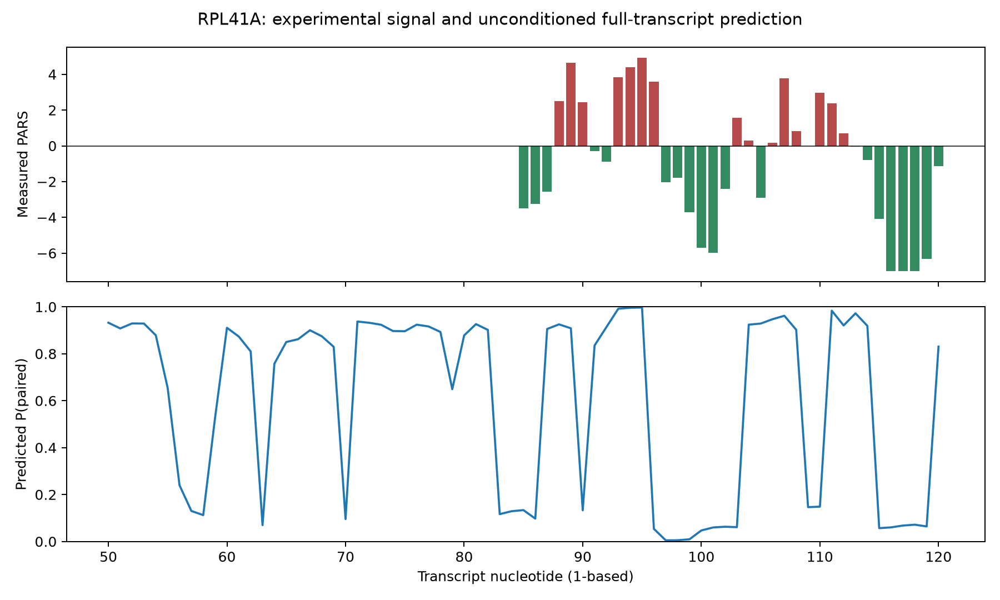

# RPL41A

Experimentally footprinted example from Figure 2c,d: YDL184C, transcript bases 50–120. Prediction uses the complete deposited 290-nt transcript. Sites are the lowest mean PARS 8-nt window and the highest non-overlapping mean PARS window with at least 6/8 measured bases; neither is selected using predictions.

RNA, Turner 2004, 37 °C, dangles=2, unrestricted global pairing. Local window and pair span equal the full transcript length for a matched-scope comparison. Experimental buffer/temperature are not asserted to match this computational protocol. Magnesium, tertiary contacts, proteins and cellular binding are not modeled. No experimental data constrain any prediction. All coordinates are one-based and inclusive.

| Site | Coordinates | Sequence | Joint P(open), global exact | Opening cost (kcal/mol) |
| --- | --- | --- | --- | --- |
| PARS_low_8nt | 113–120 | GUAAAUAA | 0.0178501 | 2.4812 |
| PARS_high_8nt | 89–96 | CAGAUCCA | 0.00041534 | 4.7990 |

| Adapter | Site | Joint P(open) | Mean per-base P(unpaired), distinct diagnostic |
| --- | --- | --- | --- |
| rnaplfold | PARS_low_8nt | 0.0178488 | 0.619647 |
| rnaplfold | PARS_high_8nt | 0.000415285 | 0.271341 |
| rnaplfold-cli | PARS_low_8nt | 0.0178488 | not provided |
| rnaplfold-cli | PARS_high_8nt | 0.000415285 | not provided |
| vienna-exact | PARS_low_8nt | 0.0178501 | not provided |
| vienna-exact | PARS_high_8nt | 0.00041534 | not provided |
| rnafold | PARS_low_8nt | not provided | 0.619647 |
| rnafold | PARS_high_8nt | not provided | 0.271341 |
| ensemble-sample | PARS_low_8nt | 0.0187 | 0.61725 |
| ensemble-sample | PARS_high_8nt | 0.0005 | 0.272162 |
| rnastructure-partition | PARS_low_8nt | not provided | 0.632318 |
| rnastructure-partition | PARS_high_8nt | not provided | 0.284515 |
| contrafold | PARS_low_8nt | not provided | 0.667458 |
| contrafold | PARS_high_8nt | not provided | 0.433008 |
| eternafold | PARS_low_8nt | not provided | 0.659682 |
| eternafold | PARS_high_8nt | not provided | 0.334576 |

The heuristic rank is not used as a pass/fail criterion. Compare probabilities and opening costs under the same scope and footprint.

| Per-base prediction model | Pearson r with PARS | Spearman rho with PARS |
| --- | --- | --- |
| rnafold | 0.5870 | 0.6117 |
| rnastructure-partition | 0.5730 | 0.6187 |
| contrafold | 0.6167 | 0.6161 |
| eternafold | 0.6199 | 0.6310 |

| Site | Mean measured PARS | Measured bases | Mean predicted pairing |
| --- | --- | --- | --- |
| PARS_low_8nt | -4.170 | 8/8 | 0.3804 |
| PARS_high_8nt | 2.840 | 8/8 | 0.7287 |

Within the footprinted domain: 35/71 bases have deposited PARS values. Pearson r(PARS, predicted pairing) = 0.5870; Spearman rho = 0.6117. Positive correlation is the expected direction. These are descriptive statistics from one small domain, without a significance or genome-wide accuracy claim.

Missing WIG entries stay missing; a measured zero stays zero. The WIG already contains processed PARS scores at nucleotide coordinates, so no additional downstream cleavage shift is applied. Its lack of strand labels can make antisense overlaps ambiguous. Genome reconstruction is checked against the deposited transcript FASTA before comparison.

Higher PARS means greater double-stranded tendency; lower PARS means greater single-stranded tendency. These assays do not measure joint opening of an 8-nt footprint or successful binding. The selected windows are relative extrema, not guaranteed binary open/closed labels. Raw cleavage depth and per-base uncertainty are not available in this processed track. Traditional gel validation concerns the domain, not a separate assay of each selected window.

[Paper, Figure 2c,d](https://www.wisdom.weizmann.ac.il/~eran/kertesz_nature_2010.pdf); [deposited experimental data](https://www.ncbi.nlm.nih.gov/geo/query/acc.cgi?acc=GSE22393).

Illustrative window comparison: **direction agrees** with the experimental ordering (PARS-low joint P=0.0178501; PARS-high joint P=0.00041534). This ordering is supplementary because PARS and joint opening are different measurements.

| Adapter | Status | Version | Error |
| --- | --- | --- | --- |
| rnaplfold | ok | ViennaRNA 2.7.2 | — |
| rnaplfold-cli | ok | RNAplfold 2.4.7 | — |
| vienna-exact | ok | ViennaRNA 2.7.2 | — |
| rnafold | ok | ViennaRNA 2.7.2 | — |
| ensemble-sample | ok | ViennaRNA 2.7.2 | — |
| rnastructure-partition | ok | partition: Version 6.6 (April 2, 2026). | — |
| contrafold | ok | CONTRAfold | — |
| eternafold | ok | EternaFoldParams.v1 on CONTRAfold 2.02 | — |

Elapsed run time: 6.07 s. [Visual pipeline report](report.html), [full JSON](report.json), [metrics TSV](metrics.tsv), [input FASTA](target.fa). Heatmaps use the complete transcript, matching the prediction scope.
